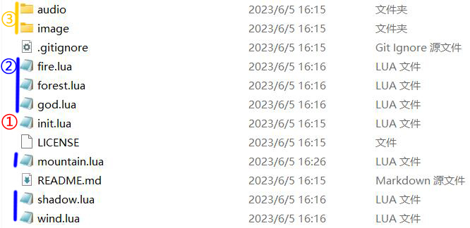
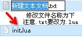
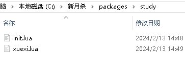
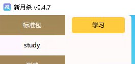
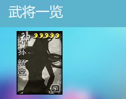

.. SPDX-License-Identifier:	CC-BY-NC-SA-4.0

创建拓展包与新武将
=======================

扩展包的内容
-------------

如在上一章所述，新月杀的游戏扩展文件全部位于packages文件夹。\
我们先看看游戏中现有的扩展是怎样的。打开packages/shzl（神话再临）：

   拓展包shzl的内部文件

init.lua
~~~~~~~~~

init.lua文件是扩展包的核心，严格意义上，扩展包只会加载init.lua，\
所以扩展中其他所有的lua文件都需要通过init.lua来加载。打开shzl的init.lua：

.. code-block:: lua
   :linenos:

   local wind = require "packages/shzl/wind"
   local fire = require "packages/shzl/fire"
   local forest = require "packages/shzl/forest"
   local mountain = require "packages/shzl/mountain"
   local shadow = require "packages/shzl/shadow"
   local thunder = require "packages/shzl/thunder"
   local god = require "packages/shzl/god"

   return {
     wind,
     fire,
     forest,
     mountain,
     shadow,
     thunder,
     god,
   }

我们可以看到通过\ ``require``\ ，对应目录下的wind风、fire火等子扩展包都加载进来了。\
同理，也可以像标准包一样\ ``require``\ 要用的翻译文件、辅助函数。\
总而言之，只有通过\ ``require``\ 才能加载init以外的lua。

我们简单地解析一下这几行代码的作用，以第1行为例：

.. code-block:: lua

   local wind = require "packages/shzl/wind"

这行代码的意思是“定义一个局部变量——\ **wind**\ ，然后将\ ``require``\ 的值赋给\ **wind**\ ”，

* \ **wind**\ 前面的\ ``local``\ 代表的就是它是 **局部变量** ，没有了\ ``local``\ ，它就是 **全局变量** 。
  全局变量和局部变量都是 **变量** 。变量在使用前，需要在代码中进行 **声明** ，即创建该变量；在lua里面， ``local a``，就是创建了一个局部变量 ``a``。
  变量可以被访问，我们可以拿他来参与运算，也可以再赋值。
  一般而言，要 **慎用全局变量** ，因为它们很容易相互打架，造成污染。全局变量会被编辑器标为红色。

* \ ``=``\ 便是编程中最常见的 **赋值** 符号，代表将右边的东西赋给左边。（可不是相等的意思，相等是 ``==`` ）\
  在lua里面， ``local a = 5`` ，就是创建了一个局部变量 ``a`` 并用 ``5`` 为其赋值。

* \ ``require``\ 则是本行代码最重要的部分，它返回之后紧跟着的双引号内的lua文件所代表的全部东西，什么都有。
  下面几行都是相同的道理，分别载入了风火林山阴雷神7个子扩展包，每个文件都有各个子扩展包的武将，例如曹仁、张角就在\ **packages/shzl/wind.lua**\ 文件里面。

* init.lua或者别的lua的最后都会有一个\ ``return``\  ，意思是返回整个模块，代表对整个文档的总结。
  这里返回了我们在上方定义的所有引用，并用\ ``{}``\ 包成了一个整体。
  第10行的 ``wind`` 就指向第1行声明过了的 ``wind`` 。局部变量在声明完毕之后，引用的时候就不用 ``local`` 啦（不然就变成再创建一个局部变量了）。

每个扩展包lua都需要\ ``return``\ 一个扩展包，否则这个扩展包就是不存在的。

.. hint::

  ``require`` 会将全局变量也加载进来，因此代码中要慎用全局变量。

.. hint::

   当然也可以在init.lua塞进扩展包全部的内容，standard标准包就是这样的。理论上这也可以，但是还是分开比较好，尤其是有下文所述限制的前提下。

子扩展包
~~~~~~~~

一个大的扩展包系列会含有多个小扩展包，例如神话再临的风林火山，\
一将成名的2011~……等。子扩展包是游戏中武将一览的划分区间。\
这样做既是为了分类美观、查找方便，也是限制单个lua文件大小。

.. hint::

  Lua语言规定单个文件至多只能有200个局部变量，\
  因此根据估算，我们建议一个子扩展包的武将数量不要超过40。

audio, image
~~~~~~~~~~~~~

顾名思义是存放扩展包语音、图片的文件夹。对于我们的第一个扩展做得简单些，\
只需要了解：audio中的death为武将阵亡语音，skill为技能语音；\
image中的general为武将图片。

其他文件
~~~~~~~~

包括开源声明、git托管文件等，先不管它们。

创建拓展包
-----------

我们模仿shzl的形式创建一个扩展。首先在packages文件夹下建立一个新文件夹。\
老传统，我们的第一个扩展就叫study学习包~

   新建文件夹

然后在study文件夹中创建一个init.lua文件。可以直接从其他包复制，\
也可以新建一个txt文本然后改名。用VSCode打开它，但在修改之前，\
请先稍微动一下手，点击右下角这一块，将你的默认缩进改为\ ``空格:2``\ ，
编码改为\ ``UTF-8``\ （默认是这个，但最好确认一下）

   注意编码必须是UTF-8，空格=2只是推荐缩进

然后修改代码，加载子扩展包：

   新建文本文件并改名

.. code-block:: lua
   :linenos:

   local xuexi = require "packages/study/xuexi"

   return {
     xuexi,
   }

.. hint::

   1. 我们在代码中利用到的标点都是半角符号，也就是英文输入模式下的标点。\
      比如第1行里的引号不是 ``“”`` 而是 ``""`` ，第4行的逗号不是 ``，`` 而是 ``,`` 。（当然，通过设置输入法，我们也可以在中文输入模式下打出半角符号~）
   2. 注意第4行开头的缩进。由于这一行属于下一个层级，我们需要往后缩进，让代码的结构更加清晰。在新月杀里，我们约定缩进2个空格。
   3. 以UTF-8无BOM格式编码。
   4. 所有文件尾必须留一个换行符，敲一个回车即可。（在这里的代码片段中，可能无法看到最后的空行，看示例代码更为清楚）

.. important::

   我们现在所做的一切操作结果都可以在 **引用示例.zip** 中找到，可以多多参考对照。

再在study文件夹下面建立一个新的xuexi.lua，修改为：

.. code-block:: lua
   :linenos:

   local extension = Package:new("xuexi")
   extension.extensionName = "study"

   Fk:loadTranslationTable{
     ["xuexi"] = "学习",
   }

   return extension
   

- 1行，声明以创建局部变量 ``extension``，将其赋值为创建出的名为 ``xuexi`` 的扩展包。这里的名字是子扩展包的名字。
  接下来的代码中， ``extension`` 就将代表整个子扩展包。

- 2行为这个子扩展包，也就是 ``extension`` ，指定 ``extensionName`` ，也就是它所属的大扩展包，其名字必须为我们文件夹的名字，
  整个大扩展包都是根据这个名字寻找路径的，包括lua，包括图片，所以不要填错。

- 4~6行是翻译表，这样在游戏中子扩展包的名字“xuexi”就会翻译为“学习”。

- 8行返回扩展包，这样程序就知道我们这个子扩展包的代码到这里就结束啦。

这样我们的扩展包就创建完成了！~之后我们的代码操作都会在这个 **xuexi.lua** 文件之内，别跑到 *init.lua* 去啦。

   创建好的扩展文件和子扩展文件

**保存** 好所有动过的文件。用 **单机启动** 打开游戏，查看武将一览，可以看到已经出现我们的学习包了，不过现在还是空的没有武将。

   学习包！说起来study还是英文呢，要不自己加一句翻译？

.. attention:: 

   新的文件、修改过的代码文件都需要在 **保存** 之后 **重新打开游戏** 才能生效。我们开发新月杀一般都是在 **单机启动** 环境下进行的。

创建武将
---------

创建新武将的话，首先也是要先想好武将的名字。
但是这件事情就简单多了，一般来说都是用TA的姓名的汉语拼音直接作为名字的。
例如曹操就是\ ``caocao``\ ，司马懿就是\ ``simayi``\ ，
当然，英文人物也可以用英文名，如某位凯撒大哥就是\ ``caesar``\ 。

看起来武将的名字比扩展包的名字好写，但其实不然。
要知道，在新月杀诞生的时候，别说界限突破了，谋攻篇都出来了，到了现在(2024年)，同名武将多到可以凑个军五甚至军八……
所以对于这些同名武将，新月杀提供了一种方法来自动识别——

当你注册一个名字格式为\ ``XXXX__YYYY``\ （这里是双下划线，如\ ``mou__caocao``\ ）的新武将时，\
系统会自动将这个名字沿中间切成两半：\
其中右边的\ ``YYYY``\ 是“武将真名”\ ``trueName``\ ，而左边的\ ``XXXX``\ 则是这个武将的特有标示，也就是“武将包名”，或称前缀。
如果两个武将拥有同样的“武将真名”，那么这两个武将就是同名武将，
例如\ ``ex__caocao``\ 和\ ``mou__caocao``\ 的“武将真名”都是\ ``caocao``\ ，那么这两个武将就是同名武将。

按照传统，我们也该写个学习包专属的孙悟空的，但是……十周年和欢乐杀已经有孙悟空了(悲)，所以在命名上我们也该规矩一点……
意味着学习包的孙悟空名字最好改成\ ``st__sunwukong``\ 了，

这里前缀取的是"st"，study嘛。在你自己的拓展包中，根据情况选定合适的前缀吧。

具体代码就是\ ``local sunwukong = General:new(extension, "st__sunwukong", "god", 5)``\ ，
之后你的xuexi.lua看起来就像这样：

.. important::

  要注意把 ``return extension`` 留在文档末尾，以下我们的操作都要在这一行 ``return extension`` 之前完成！

.. code-block:: lua
  :emphasize-lines: 8
  :linenos:

  local extension = Package:new("xuexi")
  extension.extensionName = "study"

  Fk:loadTranslationTable{
    ["xuexi"] = "学习",
  }

  local sunwukong = General:new(extension, "st__sunwukong", "god", 5)

  return extension

创建武将本质上是创建一个“\ **武将对象**\ ”，为此，让我们看向\ **武将对象**\ 的构造函数：

.. code-block:: lua

  --- 构造函数，不可随意调用。
  ---@param package Package @ 武将所属包
  ---@param name string @ 武将名字
  ---@param kingdom string @ 武将所属势力
  ---@param hp integer @ 武将初始体力
  ---@param maxHp integer @ 武将初始最大体力
  ---@param gender Gender @ 武将性别
  function General:initialize(package, name, kingdom, hp, maxHp, gender)

各参数的作用见上方，这里详细解释一下：

1. \ ``package``\ 是该武将所属的扩展包，鉴于第一行已经定义了一个\ ``extension``\ ，我们就用它了。

2. \ ``name``\ 是这个武将的名字，就用刚才起的名字"st__sunwukong"吧。

3. \ ``kingdom``\ 是这个武将所属的势力，按照传统，我们填个"god"，也就是神势力。

4. \ ``hp``\ 和\ ``maxHp``\ 分别代表体力值和体力上限，\ ``maxHp``\ 默认与\ ``hp``\ 一致，而\ ``hp``\ 默认为4。

5. \ ``gender``\ 就是武将性别，默认为\ ``General.Male``\ （男性）。

以上代码就往学习包里塞了一位名为“st__sunwukong”的5血5上限神势力男性武将~

至此武将的创建就完成了！但是如果我们现在进入游戏的话，他会显示为英文……\
那就用\ ``Fk:loadTranslationTable``\ 补一下翻译吧：

.. code-block:: lua
  :emphasize-lines: 3, 8-12
  :linenos:

  Fk:loadTranslationTable{
    ["xuexi"] = "学习",
    ["st"] = "学",
  }

  local sunwukong = General:new(extension, "st__sunwukong", "god", 5)
  Fk:loadTranslationTable{
    ["st__sunwukong"] = "孙悟空",
    ["#st__sunwukong"] = "齐天大圣",
    ["designer:st__sunwukong"] = "设计者",
    ["cv:st__sunwukong"] = "配音演员",
    ["illustrator:st__sunwukong"] = "画师",
  }

翻译表其实是个很纯粹的东西，你输入特定的字符串，就会根据翻译表输出对应的翻译字符。
以下是武将信息里除了武将名以外的其他信息：

- \ ``"#武将名"``\ 是武将的称号，理论上要多长就有多长，不过考虑到实际显示，建议限制在7个字以内。

- \ ``"designer:武将名"``\ 是武将的设计者，默认为“\ `官方`\ ”。

- \ ``"cv:武将名"``\ 是武将的配音演员，默认为“\ `官方`\ ”。

- \ ``"illustrator:武将名"``\ 是武将的画师，默认为“\ `官方`\ ”。

这些在进入游戏后的武将一览都能看到。

保存一下，到游戏里看看我们的孙悟空吧。打开武将一览->学习包：

   我们刚刚创建的悟空在此

好了，赶紧拿着你新写的这位武将去单挑吧！

PS：五体力白板孙悟空的单挑能力还是不弱的呢。^_^
