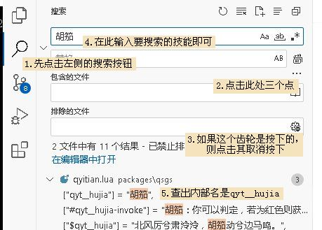
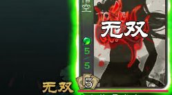

添加技能
==========

白板武将虽然不算弱（其实已经很弱），但是游戏体验还是差了点。都2024年了，\
再端上五血白板多少有点欺负自己了……

解决方法？添加个技能呗，比如说……\ **〖无双〗**\ ？正好标包有，也不用麻烦我们写了。

在vscode切到刚才的xuexi.lua，在引入孙悟空的代码下面加个代码：\ ``sunwukong:addSkill("wushuang")``

.. code-block:: lua
  :emphasize-lines: 2
  :linenos:

  local sunwukong = General:new(extension, "st__sunwukong", "god", 5)
  sunwukong:addSkill("wushuang")

就可以了。

.. note::

   在这里，像addSkill这样后面带括号的、可以帮我们完成一项功能的具体的方法，\
   就是传说中的“函数”了。新月杀的绝大多数武将扩展行为，\
   都是通过各种各样的函数分工合作，才能顺利完成的。
   （请回忆之前Lua：函数一节）

.. 像new()、addSkill()这样右侧带有小括号的代码被称之为函数，
.. 函数是调用其他部分代码的依据、是多个部分互相沟通的渠道，
.. 可以这么说，函数是新月杀扩展的根基。
.. 
.. 一个扩展包会有单独存在的函数（如一些扩展包自己的局部变量\ ``local function XXX()``\ ），\
.. 也有依附于对象存在的函数（如上文的\ ``General:new()``\ ）。
.. 
.. 由此，调用一个函数也有所讲究，这里以一个常用函数\ ``Player:getMark()``\ 为例，该函数的原型如下：
.. 
.. .. code-block:: lua
.. 
.. 	--- 获取角色对应Mark的数量。
.. 	---@param mark string @ 标记
.. 	---@return any
.. 	function Player:getMark(mark)
.. 
.. 假设\ ``player``\ 是一个\ ``Player``\ ，我们可以使用\ ``player:getMark("XXX")``\ 调用这个函数，
.. 当然，我们也可以用\ ``Player.getMark(player, "XXX")``\ 调用这个函数，二者返回的结果是一样的。
.. 
.. 可见用冒号\ ``:``\ 调用函数的话，相当于将左边的对象传入了第一个参数，就不用在括号内写第一个参数的值了。
.. 	
.. 然而，另一个常用函数的\ ``table:map()``\ （虽然是table的函数，但实际上这不是lua原生的函数）的原型如下：
.. 
.. .. code-block:: lua
.. 
.. 	---@param func fun(element, index, array): any
.. 	function table:map(func)
.. 
.. 但是实际上大家调用函数时，使用的不是\ ``tableA:map(...)``\ ，而是\ ``table.map(tableA, ...)``\ 。
.. 关于什么时候可以/不可以用冒号\ ``:``\ 调用函数，这涉及到Lua库对一些自定义类型的特殊处理，这里不再赘述。
.. 
.. 总而言之，日常编程时，除了调用table的函数需要用英文句号\ ``.``\ 以外，
.. 其他地方用\ ``:``\ 调用函数会将自身传入函数的第一个参数（如果函数自身就是用冒号声明的话就是单独的一个\ ``self``\ 变量（这也是这个函数的真正的“第一个参数”））。

.. 技能的内部名称一般是他的拼音。
.. 
.. 要注意的是，\ **〖无双〗**\ 是吕布这个技能的中文名，而现如今，\
.. 技能重名更是家常便饭，你看界吕布也有个\ **〖无双〗**\ 嘛~
.. 
.. 所以我们给孙悟空安上\ **〖无双〗**\ 的时候，要找的是这个技能的“内部名字”，或者说——\ `本名`\ 。
.. 
.. 最简单的方法就是直接全局搜索“无双”，找到翻译部分的代码，
.. 因为翻译表是一一对应的，所以会有个\ ``["wushuang"] = "无双"``\ ，
.. 这样我们就知道标吕布的\ **〖无双〗**\ 名字叫\ ``"wushuang"``\ 了。

至于\ ``General:addSkill()``\ ，这个是真正赋予武将技能的函数，有了它，孙悟空才能拥有这个技能。
该函数的原型如下：

.. code-block:: lua

	--- 为武将增加技能，需要注意增加其他武将技能时的处理方式。
	---@param skill Skill @ （单个）武将技能
	function General:addSkill(skill)

显然，这个函数可以接受一个技能\ ``Skill``\ ，也就是一个属于技能对象\ ``Skill``\ 的变量；
但同时，这个函数也可以接受字符串，此时就可以添加别人的技能了~

注意武将名称（sunwukong）和函数名称（ ``addSkill`` ）之间的那个符号，是冒号！

因为我们的武将名称sunwukong在之前那个 ``General`` 函数的引诱下已经成为了\
孙悟空这个武将的形象代言人了，它代表了一个武将对象（ ``General`` ）；\
而这个函数 ``addSkill`` 正是武将对象中的一个功能，我们称它为 ``General``
的成员函数（亦称方法）。一个对象调用自己的成员函数的时候，\
代码里需要用冒号手拉手，来表示这种调用关系的。

无双的技能名字是wushuang。一般地，技能的名字就是它的汉语拼音了，\
比如马术就是mashu，奸雄就是jianxiong，挑衅就是tiaoxin。

当然也有例外，如曹操的护驾是hujia，倚天蔡昭姬的胡笳则是qyt__hujia，毕竟不能重名嘛。
有关技能名字的信息，必要的时候还是要查看一下源代码的。

方法很简单，先点击左侧栏的放大镜开始全局搜索，然后将排除文件去掉
（这样就能搜索所有的文件了），然后搜索我们想搜索的技能名就行了：

   借由全局搜索功能找到想要的技能名

保存一下，打开游戏，放到实际对局试试吧！

.. note::

   想稳定选到孙悟空的话，需要利用自由选将功能。创建房间之前启用自由选将，\
   然后在选将时右键单击待选武将牌即可。

   会无双的悟空

这回总可以好好单挑了，五血无双还没负面技，总该……
