武将美化
========

武将有了技能，就该出来亮相了。但是总不能老让人家挂着貂蝉剪影乱跑吧？\
该有的美化工作还是要有的。武将的美化，在新月杀中只需要制作一张全身大图即可。

当然，美化之前问一问，做好准备了吗？Let’s go！

软件准备
----------

我们这里介绍用Gimp来裁剪图片吧。Gimp是一款挺有名气的免费开源图像处理软件哦。

前往官网下载吧： https://www.gimp.org/downloads/

官网提供了三种下载方式，这里我点击第二个“直接下载”。

Gimp的安装也是很简单的，一路下一步就行了，视情况安装到D盘亦可。

图片准备
---------

然后找一张图片做武将原画，上网搜一下吧。

要是找三国人物的话，现在三国杀的皮肤那么多，尽情选择吧。

孙悟空的话……还是去百度图片搜索找找看好了。

.. .. figure:: pic/3-1.jpg
   :align: center
   
..   这张如何？

OK，总之准备就绪。

处理图片
---------

我们所需的武将大图，相关信息是这样的：

- 像素尺寸：250x292
- 图片格式：jpg格式
- 存放位置：我们的拓展包/image/generals下

嘛，首先我们先用Gimp打开图片，然后选择裁剪工具：

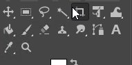
   
勾选固定宽高比，然后将宽高比设为250:292，像这样：

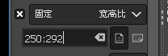

然后再设置好参考线，待会我们要基于参考线裁剪图片的：

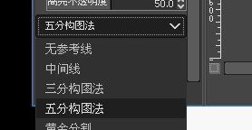

设置完了！开始切割图片吧。裁切的时候，注意让人物的头部位于第二行第三列那个\
格子左右的地方，这样就很有那种头部中等偏上的半身图感觉哦！

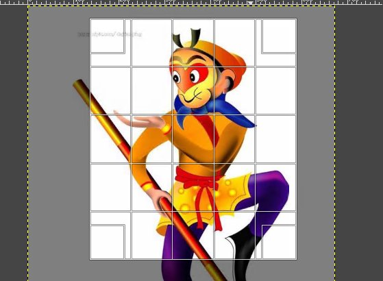

这样基本框定后，按下回车键，图片就裁切完了。但是现在还只是我们的图片是250:292\
而已，而尺寸要求是严丝合缝的250x292像素，所以我们还需要再把图片缩放一次。\
在图上右键单击，选择图像->缩放图像，开始修正尺寸。

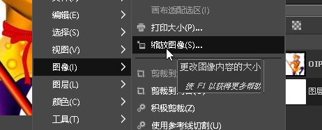

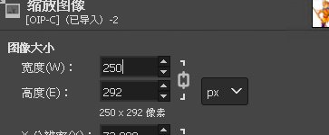
   
   毫无疑问，要缩放成250x292 px

大功告成！导出图片吧。右键文件->导出为……

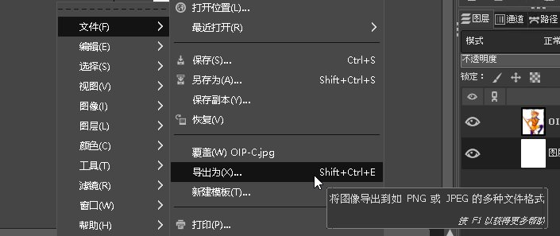

注意文件名应该和我们武将的命名一致。没忘记我们给武将取了啥内部名字吧？

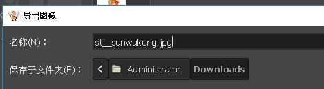

点击导出，这样就到了我们导出的最后一关了。我们把质量设为80，这样尺寸和画质\
都处于比较均衡的水平。

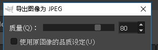

将图片加入游戏
---------------

现在图片也准备就绪了！我们最后一步就是把图片放入拓展包中。

图片的位置上面提到过了，是拓展包下面的image/generals下面。\
毫无疑问，现在我们包里面还没有这样的文件夹，没有就新建！最终效果如下：

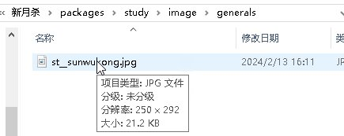

打开游戏！进入武将一览查看详情！

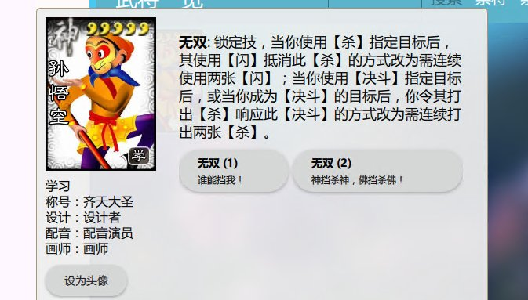

   好，很好，非常好

要不再点一下设为头像看看效果：

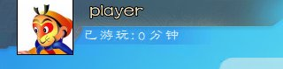

   小头像哦

如果想要创建自己的势力图的话，只需要把图片放到image/kingdom下面

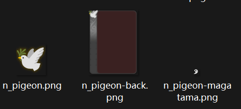

   可以看见有三个文件

第一个文件是n_pigeon.png,这个是势力的图片，名称是n_pigeon，后缀是png，格式大小是设置为30x30像素。

第二个文件是n_pigeon-back.png,这个是势力的背景图片，名称是"势力名称"-back，后缀是png，格式大小是设置为175x233像素。

第三个文件是n_pigeon-magatama.png,这个是势力的勾玉图标，名称是"势力名称"-magatama，后缀是png，格式大小是设置为10x12像素。

顺带提一嘴，卡牌的格式是90x130像素，后缀是png。
除了武将图是jpg格式以外，扩展包内其他带图片的都是png格式。