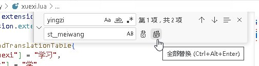

创建一个新技能
===============

重头戏来了！

前面我们就知道了，武将的游戏体验和TA的技能如何有着好大好大的关系。\
怎么样？五体力上限带无双的孙悟空是不是比五体力上限的白板孙悟空玩起来带劲儿多了？

现在我们要继续强化这种体验感了！打造真正拥有自己个性的新技能！

听说周瑜因为长得帅所以能多摸牌？我们美猴王孙悟空怎么样？摸死你！

现在打开刚刚遗忘在角落里的xuexi.lua吧，要写代码了～

先把一份英姿的代码拷贝到我们的扩展包文件里面去吧。

.. code:: lua

  local sunwukong = General:new(extension, "st__sunwukong", "god", 5)

  local yingzi = fk.CreateTriggerSkill{
    name = "yingzi",
    anim_type = "drawcard",
    events = {fk.DrawNCards},
    on_use = function(self, event, target, player, data)
      data.n = data.n + 1
    end,
  }

注意定义孙悟空的那句话一开始就有了，只是演示该粘贴的位置哦。

什么？哪里搞到的？当然是全局搜索咯。新月杀已有的技能也全都是用Lua语言写的，\
我们稍微搜搜技能内部名称自然就找到它们的Lua代码了。

言归正传，孙悟空那头都快上火了。

周瑜英姿多摸了一张牌，看到代码里面那个数字"+1"了吧？

.. code:: lua

   data.n = data.n + 1

孙大圣那可是"美"猴"王"啊，才多摸一张牌哪儿说得过去啊？在后面加个零，多摸十张！

.. code:: lua

   data.n = data.n + 10

行了，满意了。

核心代码已经完成，不过还有点需要修饰的工作要做。

技能名字要改改吧？重名的话，小心启动不了游戏哦。

把整个技能代码段选中，CTRL+H把替换窗口叫出来。（在右上角那里呢）\
原来的技能叫什么来着……yingzi，嗯就是它，写在第一栏。\
再起个新名字，就叫st__meiwang好了，写在第二栏那里。

点击全部替换，名字就改掉了！

然后是翻译（还记得那个sgs.LoadTranslationTable吧？）：

.. code:: lua

  ["st__meiwang"] = "美王",
  [":st__meiwang"] = "摸牌阶段，你可以多摸十张牌。",

翻译一个技能是有一些要注意的地方的。

翻译技能的通式是这样的：

.. code:: lua

  ["技能名字"] = "技能名字的译文",
  [":技能名字"] = "技能的描述",

技能名字的译文不要超过两个汉字，否则在游戏界面里面会显示的很奇怪……

技能名字前面加冒号，表示的是技能的描述。这个描述文本中可以加上HTML标签\
以制造某些文字效果，就跟网页代码一样。比如用<b>和</b>将一段文本夹起来，\
这段文本就被加粗了，要知道字体加粗是可以来显示锁定技、限定技、\
觉醒技之类的提示语的。

.. hint::

   不过在实操中，我们不要对锁定技之类的提示语手动加粗。

现在技能已经写好了，剩下的只需要把这个技能添加到武将身上就行了。\
没错，还是用我们已经熟悉的 ``addSkill`` 函数，不过这次不用字符串形式了。\
这是因为技能对象 ``st__meiwang`` 是在同一个文件中创建好了的，\
不用引用别人的恩赐了！

.. code:: lua

   sunwukong:addSkill("wushuang")
   sunwukong:addSkill(st__meiwang)

技能就添加完成了！赶快到游戏里面体验这个拥有强力摸牌技能的齐天大圣孙悟空吧！
