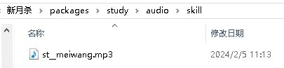

添加音效
=========

作为一个全方位立体化的武将扩展行为，音效的搅和也是必要的吧？\
耳旁还回荡着那动人的“犯大吴疆土者，盛必击而破之！”\
我们的新武将怎么能不来跟个风呢？

打造自己的声音工作室
---------------------

新月杀的声音文件是mp3格式的，保存在拓展包的audio文件夹下。所以，别拿着什么\
wav、wma、mp3之类的干瞪眼了，试一试格式工厂吧。

严格地说，我们还需要拥有一个音频处理软件，用来进行可能的音频截取、\
音频合并、音频修整等操作；如果想使用自己的声音，还需要一个录音软件，\
甚至硬件上的配合（比如话筒等）。这里推荐开源音频处理软件Audacity哦。

好的，这样基本上我们的声音工作室就成型了。

添加技能使用音效
------------------

之前在武将一览里面，我们新技能“美王”根本没显示配音播放按钮呢。
这就是因为没有对应的配音文件啊。这就去给他补上！

从网上找一段孙悟空的音频，下载之，或者利用Audacity进行电脑内录。\
然后继续扔到Audacity里面裁剪成我们需要的样子，"导出->mp3"，\
这样得到了处理后的mp3格式的音频，大功告成。（编者：其实我们是来炫耀肺活量的……）

.. hint::

   为了不让加入的配音文件体积过大，请将码率设为96Kbps~128Kbps左右。
   在拓展包中占体积大头的就是语音，控制好体积还是需要注意的。

不管怎么说吧，反正现在是得到了mp3的配音文件，但是！文件的名字还没改嘛。\
先想想技能的名字叫什么来着？嗯，是st__meiwang，所以配音文件的名字也就可以\
确定了，同样是：st__meiwang。（编者：团结一致向前看！）

接下来要做的就是把配音文件放到audio文件夹里面去了。但是！\
可不是直接放到audio文件夹下，而是放到里面那个skill文件夹下，\
因为我们现在做的是技能配音文件。

给技能配音文件起名字的通用方法是：

- 技能名字
- 技能名字＋编号

比如刚刚我们就是用的第一个方法。st__meiwang.mp3。

至于第二个方法，是当我们觉得这个技能需要分情况说台词的时候，\
或者就是有多个配音文件的时候，为了统一管理才用的。

看看这个游戏中绝大多数的技能都是有两句语音吧？一句多单调啊。

当使用第二个方法在技能名字后面添加编号的时候，在界面上相应地也会显示一个编号。

总之我们已经把音效放到正确的位置了，打开游戏体验吧。
等会，怎么界面上没显示台词呢？原来还是忘记写翻译了呢。

打开我们的拓展包xuexi.lua，在翻译表把台词加上！

.. code:: lua

  ["$st__meiwang"] = "技能 美王 的台词哦。",

台词的通用写法就是这样，用美元的那个符号引导：

.. code:: lua

  ["$技能名称"] = "台词译文",

或者说是：

.. code:: lua

  ["$技能名称与编号"] = "台词译文",

用于翻译那类带编号的技能配音。
（孙悟空：有什么了不起的啊？不就是用配音文件的文件名嘛……）

写好后重新启动游戏，这下终于看到亲切的台词了：

搞定！

添加武将阵亡音效
-----------------

“霸业未成、未成啊……”

武将们总会有离开游戏的那一刻的，还是要给他们一个抒发壮志未酬满腔遗憾\
真不科学的感情的机会的啊。现在我们来为我们的新武将添加一个阵亡音效好吧。

其实和技能音效类似了，依然是各种选材、剪辑、格式转换工作，\
最后得到了我们需要的一份mp3格式的阵亡配音文件。

但是，文件名呢？毕竟不是技能配音啊，哪有技能名字可用啊？

其实，武将阵亡的配音文件的文件名，就是这个武将的名称了！\
所以我们现在做好的这份配音文件，就是st__sunwukong.mp3！

把配音文件放到拓展包下的audio/death/文件夹中，阵亡配音也就有了～

等等，好像还少点什么事情没做……嗯，是台词翻译！阵亡了也要有那么几句话不吐不快嘛。
接着打开扩展包文件study.lua，拉到最下面，找到翻译表，加上一句：

.. code:: lua

   ["~st__sunwukong"] = "不！还不可以死……",
   
（孙悟空：％@＆＃％＆％＃@……）

算了还是按照实际情况写吧！总之这句话通常意义上是这么写的：

::

  ["~武将名称"] = "武将阵亡台词译文",

最前面那个小波浪"～"，代表相反的意思，生的反义词自然就是死啦，
所以这样就表示武将的阵亡台词了。（听说人家程序员叫：析构）

不用管那么多了，保存一下，赶紧到游戏里面看看效果吧！

啊，还有一件事。如果是自己配的音，不要忘了把前面那条翻译：
``["cv:武将名称"] = "配音人员",``
里面的配音人员改成自己的名字哦～

解决！
