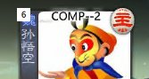

修改距离
===========

军争时代，节奏加快，距离的重要性大大加强了。对于一个跟头十万八千里的孙悟空\
来说，当然不能忍受落在他人的后面！筋斗云，我们一起去代码里面讨个公道……

好吧，那么这次我们就要为我们的新武将创建这样一种可以用来修改距离的技能。

先把马术的代码拿来研究一下：

.. code:: lua

  local mashu = fk.CreateDistanceSkill{
    name = "mashu",
    frequency = Skill.Compulsory,
    correct_func = function(self, from, to)
      if from:hasSkill(self) then
        return -1
      end
    end,
  }

可以看到，创建距离修改技能需要用到一个叫做 ``fk.CreateDistanceSkill``
的函数，其原型是：

.. code:: lua
  
  fk.CreateDistanceSkill{
   name = "xxx",
   frequency = xxx,
   correct_func = xxx,
 }

这个方法有三个参数，name, frequency和correct_func。

- ``name``: 表示这个距离修改技能的名字；
- ``frequency``: 技能的标签。一般来说修改距离的技能都是锁定技啦，填入\
  ``Skill.Compulsory`` 就表示是锁定技了。
- ``correct_func``: 是一个规定距离修改标准的函数，告诉电脑具体怎样计算距离。

其中这个 ``correct_func`` 函数的原型是: ``function(self, from, to)``
它需要三个参数，分别是self, from和to。

- self：就是技能本身啦；
- from：是位于距离计算的起点处的那个角色。因为距离计算是有方向性的呀，
  当然需要一个起点角色，还有一个终点角色了。
- to：不用说了，这就应该是位于距离计算的终点处的角色了。

因为距离计算的特性，距离修改技能的效果是对距离计算的双方都有影响的，\
所以即使我们本身没有这个技能，计算距离时也要考虑对方是否有类似的技能。\
故而 ``correct_func`` 函数中提供了两个角色对象 ``from`` 和 ``to`` ，\
用来考虑这两方面的计算情形。

对于马术来讲，它的描述是“你计算与其他角色的距离-1”，所以当拥有马术的我们\
处于起点，其他角色作为终点的时候，马术就会起作用。而当我们自己作为终点，\
其它角色处于起点的时候，即使我们拥有马术，也没有效果。

所以马术的代码里面，只需要考察 ``from`` 是否拥有马术这个技能，\
进行距离修正就可以了。可以想到，飞影的代码里，\
应该也只需要考察 ``to`` 就可以了。\
而义从的代码里面则要 ``from`` 和 ``to`` 两方面都要考虑才行。

现在我们要为孙悟空设计距离修改技能了。想法是这样的：

“腾云：你计算的与其他角色的距离-5；其他角色计算的与你的距离+5。”

代码如下：

.. code:: lua

  local tengyun = fk.CreateDistanceSkill{
    name = "st__tengyun",
    correct_func = function(self, from, to)
      if from:hasSkill(self) then
        return -5
      end
      if to:hasSkill(self) then
        return 5
      end
    end,
  }

别忘了用addSkill让悟空学会该技能！

好了，赶紧体验一下这种高耸入云无人能及的感觉吧！

悄悄地告诉自己：按下D键可以查看到他人的距离。

我们来实操一下，开桌军八，可以看到到所有人距离都是1了。

不过怎么看别人到我的呢？这里就轮到我们重要的测试工具人——谋徐盛出场啦。

开2人身份局，点将谋徐盛（测试包中，或者直接用搜索功能）。
然后发动技能“变更”将对方变成孙悟空，接下来按下D键查看距离：

至于设计实现类似“与某名角色的距离始终为1”的效果， ``CreateDistanceSkill``\
其实还提供了 ``fixed_func`` 这个参数，他和 ``correct_func`` 类似，\
只是把之间的距离设为了固定值，这个就请自己探索吧！

