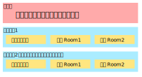

写在前面
==========

所以说你最终通达了拓展制作之道，想要来做一些更酷的事情？这一部分就是为了\
让你对新月杀的了解更上一层楼而编写的哦。

这些文档的目的是带你对新月杀底层有进一步了解。当然了，不可能再像之前拓展教程\
讲的那么详细啦，咱们只挑关键的说明，更多细节就请自己在代码中寻找答案吧。

新月杀架构略图
---------------

在开始之前，让我们先对新月杀的架构有一个略微的了解吧。\
新月杀是一个C/S架构的程序，说明至少有两套架构（其实也差不多）。\
虽然代码仍然会更新，但是架构是基本不会变化的咯。

.. uml:: ./uml/intro-arch.puml

此外服务端的线程模型也值得注意，如图：

- 主线程：负责处理用户登录、发送房间列表等与游戏无关的事情。
- Lua线程：负责所有的游戏逻辑。服务端有很多房间同时运行着，其中每个房间都\
  对应一个Lua协程。

此外还有一个心跳包线程和服务端Shell线程，这俩因为不重要就不提了。

参与到新月杀本体的贡献之中
---------------------------

最开始拟定框架的时候就确定了“本体精简到只含标准包，其他拓展包作为单独仓库”。\
为了方便玩家下载，拓展包都直接放在Gitee中，不过本体本身一直在Github维护。
https://github.com/Qsgs-Fans/FreeKill

当然了，还是为了方便下载，Gitee上一样有一个本体的镜像仓库：
https://gitee.com/notify-ctrl/FreeKill 但是这个仓库的master比Github要落后，\
只在发生版本更新的时候才会同步一次。

若想贡献本体的代码，需要走Fork+PR的流程。肯定是建议在github上发起PR，\
但是实在连不上Github的话，在Gitee发起PR也行。还是建议想办法连一下Github。
