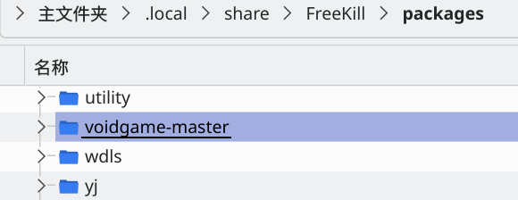

象棋#1 定义静态数据
============================

现在我们来重温一遍中国象棋开发之路吧。首先第一步我们需要创建一副棋具，然后才能围绕它开发更复杂的功能。

环境准备
-----------

等会，其实你并没开发过新月杀拓展？那么请看这几篇熟悉一下基本流程吧，假定你已有Lua基础了（以及QML基础...）

- :doc:`../for-creators/anhe/00-prepare`
- :doc:`../for-creators/anhe/01-hello`
- :doc:`../for-creators/anhe/06-git`

此外还需要你对 `middleclass <https://github.com/kikito/middleclass>`_ 有所了解，
这是Freekill使用的Lua面向对象库。自然而然的，接下来的代码需要你接触过面向对象编程。

Freekill还使用 `LuaLS注解 <https://luals.github.io/>`_ 提升Lua编程体验。
作为桌游开发者，你有责任设计自己的类、方法、拓展API（TODO：目前无法拓展）等，因此需要对注解格式有了解。

好了，现在你已经能创建最基本的拓展包，并且能使用git了。新的桌游也是通过拓展包的方式加载到Freekill中的，
因此我们还是需要从创建拓展包开始。但是创建桌游比较复杂，前文所述的四个环节只要缺少任何一个，桌游就运行不起来。
解决方案是先找到一个没有棋具、没有状态、没有规则，甚至连界面都没有的全空白桌游模板，
然后我们再按顺序不断丰富它的内容。

开发组为此已经准备好一个桌游模板了，请看： https://gitee.com/qsgs-fans/voidgame 。
我们通过下载ZIP的方式先将模板下载下来吧。

   下载后解压到packages/底下，如同创建新拓展一样

好了，接下来我们从模板改造出一副象棋吧。首先第一件事是将模板里面需要改名的改名！这就需要解释一下模板了。
首先，模板的目的就是为了让你用文本替换创建自己的桌游模板，以下是需要替换的文本：

- ``"voidgame"``: 拓展包的名字
- ``"voidsubgame"``: 桌游子模块的名字
- ``"VoidGame"``: 该桌游的命名空间，毕竟要定义很多类

替换完文本后还需要对几个文件进行重命名：

- ``voidgame-master/``: 就是根文件夹，改成拓展包实际名字
- ``/voidsubgame``: 桌游子模块的名字
- ``/Fk/Pages/VoidGame``: UI界面的文件夹名字，改成对应命名空间
- ``/pkg/gamemodes/voidgame.lua``: 改成拓展包名字。该文件内部还有游戏模式的翻译文本，根据情况修改。

考虑到确实有个象棋模式了，我们这是以了解新桌游做法为目的另外做的象棋，
不妨将包取名为myxiangqi，那么命名空间就是MyXiangqi了。
还有个桌游子模块名字，也一起叫myxiangqi好了。决定好之后就用VSCode全局替换之类的办法换换名字吧。

现在启动游戏，选择游戏模式，应该能在游戏模式看到一个“无”的游戏模式。选择该模式，开始游戏，
发现自己来到了一个完全空白的界面，并且游戏也立刻结束了（游戏结束日志显示在黑窗口中）。

全过程中不应该出现弹窗报错，如有报错需要先解决。至此已完成环境配置。不过我们接下来并不会去实际编写代码就是了。

定义静态数据
----------------

我们要做的第一件事就是定义静态数据，造好一套棋具。我们要完成这两个任务：

- 定义自己的Engine类
- 完成Engine类的实例化
- 加载数据到Engine实例

Engine就是存放着各种静态数据的场所，我们创建Engine的实例之后，就相当于持有了棋具本身。

我们来看象棋的实际代码，打开 ``xiangqi/core/engine.lua``:

.. code:: lua

   ---@class Xiangqi.Engine : Base.Engine
   ---@field public pieces table<integer, Xiangqi.Piece>
   local Engine = Fk.Base.Engine:subclass("Xiangqi.Engine")

   -- ...

   function Engine:initialize()
     Fk.Base.Engine.initialize(self)

     self.pieces = {}
   end

   function Engine:addPiece(piece)
     self.pieces[piece.id] = piece
   end

   ---@param id integer
   ---@return Xiangqi.Piece
   function Engine:getPieceById(id)
     return self.pieces[id]
   end

   -- ...

   return Engine

Engine中的内容需要结合具体桌游考虑。对于象棋而言，只需要定义棋子就可以了。
上面的代码就让Engine类保存着棋子，并提供了加载和读取棋子方法。

假设我们是从头开始开发象棋的，那么在写Engine之前自然要先去完成：

- 设计棋子类： ``Piece``
- 基于棋子这一基类，派生出各种具体棋子的子类

毫无疑问，这样的类的可行设计方法很多，我的设计方案是：

.. uml:: uml/xiangqi-piece.puml

棋子基类提供抽象方法 ``canMoveTo`` ，根据棋盘状态判断能否移动到目标点。具体的子类去实现它。

至此我们完成了Engine类的定义，接下来需要做的是实例化与加载元素。这些是在 ``xiangqi/init.lua`` 完成的：

.. code:: lua

   local engine_klass = require "packages.chess-games.xiangqi.core.engine"

   local Rook = require "packages.chess-games.xiangqi.core.pieces.rook"
   -- ...

   -- 完成Engine的实例化
   local Xq = engine_klass:new()

   -- 加载棋子
   Xq:addPiece(Rook:new(Xq.rR1))
   -- ...

   -- 加载翻译表...

   return Xq

我们自己的桌游会很频繁的引用Engine实例，所以将Engine实例放在子模块的init.lua下能缩短require路径长度（但不多）。
由于历史原因，Freekill的Lua代码中含有大量全局变量，但我们自己开发新桌游必须不能添加全局变量（唉LTK模式搞特殊）。
需要使用某个“全局变量”或者类型时，需要在那个文件的开头用require函数包含进来，就像其他语句的import那样。

总结
--------

至此我们已经定义了一副棋具，需要做的事情有：

- 设计棋子的基类，并实现各个子类
- 设计Engine类，让它保存棋子的实例
- 实例化Engine
- 实例化各个棋子，并加入Engine中

（TODO）之后还会有从拓展包中动态加载拓展到Engine的写法，但是象棋规则简单，不需要支持拓展性。
