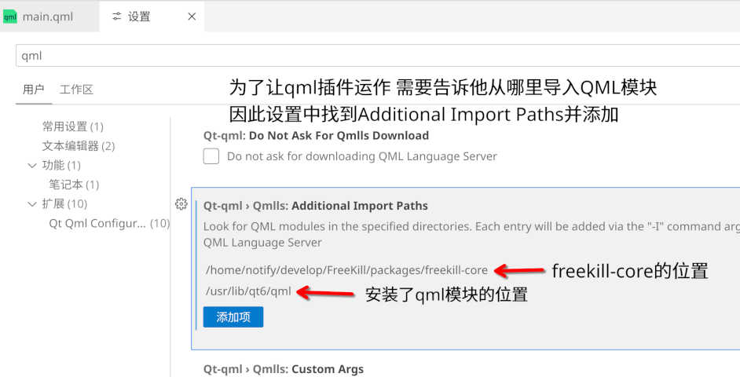

速通QML基础知识
==================

此为QML的快速简介，若你已熟悉QML基础请跳过。

本文档会大量援引QML官方文档，因为其中已有详细的说明以及代码示例。而且QML官方文档有中文了诶（然而是机翻，当读到难以理解的语句时建议切回原文）

QML官方的教程请见 `Qt Quick <https://doc.qt.io/qt-6/zh/qtquick-index.html>`_ 以及 `QML参考资料 <https://doc.qt.io/qt-6/zh/qmlreference.html>`_

亦可参见 `KDE的QML快速入门 <https://develop.kde.org/docs/plasma/widget/qml/>`_

背景知识
-----------

需要有JavaScript（ES6标准）知识，此处不论。

我们不讨论C++语言，但你需要知道Qt的 ``QObject`` 相关知识。请阅读：

- https://doc.qt.io/qt-6/zh/qtcore-index.html
- https://doc.qt.io/qt-6/zh/object.html
- https://doc.qt.io/qt-6/zh/properties.html

几句话概括就是：

- ``QObject`` 可以有许多个子对象（子 ``QObject`` ），进一步组成一棵对象树
- ``QObject`` 支持信号和槽，发出信号后槽函数会调用
- ``QObject`` 支持属性

环境搭建
-------------

后面会牵涉到许多实例代码，边尝试边学习的话效率更高

在Linux中安装KDE Plasma 6桌面后，Qt会作为依赖安装，可以直接用 ``qml6 XXX.qml`` 查看运行效果

Windows可以先安装Qt开发包，然后使用Qt Creator创建白板Qt Quick项目进行尝试，或者 `配置好VSCode上的Qt插件 <https://doc.qt.io/vscodeext/index.html>`_ 并在那里编辑Qml文件。

简单概括就是找到Qt Qml插件下载安装，然后他提醒你要不要下载qmlls，点击下载，然后按图中配置：

其中/usr/lib/qt6/qml是Linux系统一般的Qt安装位置，对于Windows系统的话，这个目录可能是 ``C:\Qt\6.9.0\lib\qml`` 之类的路径，总之就是Qt安装目录里面有个QtQuick文件夹的地方。

基础语法
-------------

一个QML文件的内容格式为：

..

  一系列import语句

  一个对象声明

import语句可以导入QML模块。对象声明定义了要创建的QML对象树，对象声明描述了要创建的对象类型，以及赋予对象的属性。每个对象还可以使用嵌套对象声明来声明子对象。

关于上面的详情，详见 `QML语法基础 <https://doc.qt.io/qt-6/zh/qtqml-syntax-basics.html>`_

Item
----------

Item是最基础的可视QML组件。可视化组件主要关心以下几个要素：视觉父对象（parent）、坐标系。详见 `可视画布 <https://doc.qt.io/qt-6/zh/qtquick-visualcanvas-topic.html>`_

- Item的xy坐标都是相对于parent而言
- 在一个Item规定的坐标系中，左上角是(0, 0)，右下角是(width, height)

Item默认的宽高都是0px，并且它的尺寸不会自动增长到子对象们的尺寸，亦不会自动填充父对象。

anchors
------------

界面的目标之一是把相应的组件按一定布局显示在屏幕上。布局一般有这些方式：

- 手动写死每个组件的xy坐标
- 基于 `属性绑定 <https://doc.qt.io/qt-6/zh/qtqml-syntax-propertybinding.html>`_ 指定会自动变化的xy坐标
- 锚定布局（anchors）
- 定位器
- QtQuick.Layouts

锚定布局的基本思路是：每个组件都有七条不可见的锚定线。通过 ``anchors.xxx: yyy`` 可以把某一条锚定线贴到另一个组件的锚定线上，从而完成布局。详见图文并茂的官方文档 `使用锚点定位 <https://doc.qt.io/qt-6/zh/qtquick-positioning-anchors.html>`_

锚定布局的性能比属性绑定更好。

QtQuick.Layouts
----------------

另一种常用的布局方式，详见 `Qt Quick 布局 <https://doc.qt.io/qt-6/zh/qtquicklayouts-index.html>`_

qmldir
---------

当你有一个内含很多qml文件的文件夹时，最好将其做成QML模块以便他人import。详见 `模块定义 qmldir 文件 <https://doc.qt.io/qt-6/zh/qtqml-modules-qmldir.html>`_
