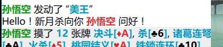

添加提示信息
=============

游戏的互动性很强大，我们新月杀自然也不例外。不仅仅是游戏界面，\
甚至还包括代码层次上的互动呢！

添加代码注释
--------------

在Lua文件中，代码注释主要有两种，单行注释和区块注释。

单行注释的符号是英文状态下的两个减号 ``--`` ，本行从这个符号开始，\
向后的所有内容都算作注释文本了。

.. code:: lua

  local extension = Package:new("xuexi")
  -- 我是单行注释 ^_^
  extension.extensionName = "study"

区块注释的符号则比较复杂，像括号一样分为两个部分。

前半部分是英文状态下的两个减号和两个左侧的方括号 ``--[[`` ；\
后半部分呢，就是两个右侧的方括号 ``]]`` 了。

被这两个部分括起来的文本，就都算作注释文本了。

悄悄地记住：被注释的文本是会被新月杀杀忽略掉的，所以可以在注释里面随便写东西喽！

还有一个小窍门：区块注释可以用来封杀一段Lua代码，不让它们出现在游戏中。\
以后心情好了还能取消注释，这样就不用直接删除某些代码了。

使用了注释的话，被注释的文本会被涂抹成不显眼的颜色，看上去其实还是挺养眼的……

注释有什么用处呢？答案：交流。

.. code:: lua

  --[[
    拓展包名称：学习包（xuexi）
    说明：这个拓展包是我学习武将拓展用的
    作者：notify
    武将数目：总共1名武将，已完成1名武将
    武将列表：
      孙悟空（st__sunwukong）
    尚需完善的内容：好多好多……
    备注：
      百度新月杀吧欢迎您！
  --]]

可以注明代码的作者、功能、版本信息；

可以注明代码的参数要求如何、效果是什么；

可以注明代码的设计思路；

可以注明代码中还存在的问题、注明还需要写些什么；

可以注明代码的各种各样的细节信息……

甚至可以写上一句“写完这一段要记得去吃泡面哦 ^_^”。

总之是……很有用的（培养办公室恋情的必备工具～）。

显示战报信息
-------------

如果说代码注释是写游戏的人们之间的交流，\
那么提示信息就让我们玩游戏的人也加入了这个温馨的圈子。

说到提示信息，首先应该认识一下新月杀为我们提供的一个信息结构体：
``LogMessage`` 。

.. code:: lua

  -- 见于lua/server/system_enum.lua
  ---@class LogMessage
  ---@field public type string
  ---@field public from? integer
  ---@field public to? integer[]
  ---@field public card? integer[]
  ---@field public arg? any
  ---@field public arg2? any
  ---@field public arg3? any

从中，我们可以看出 ``LogMessage`` 由以下一些参数构成：

1. ``type``:信息的输出类型
2. ``from``:涉及的行为发起者
3. ``to``:涉及的所有行为接受者列表
4. ``card``:可能涉及的卡牌信息
5. ``arg``, ``arg2``, ``arg3``:可能涉及的参数，最多带三个

首先，要显示提示信息，应先创建一条消息，也就是要产生一个 ``LogMessage``
结构体的实际对象。对应的代码是这样的：

.. code:: lua

   local msg = {} -- 创建一个LogMessage

通过这条代码，我们定义并创建了一个消息，名字叫msg。

.. hint::

   什么这不就只是一张表而已吗！确实是。Lua中万事万物都是表，
   只是我们给某些表赋予了特殊的意义而已。

然后呢？想想我们要向玩游戏的人说什么话。比如说：

"Hello！新月杀向你 孙悟空 问好！"

在这句话里，我们表达的是一个问好的行为，而孙悟空则是这个行为的接受对象。\
因此对应到 ``LogMessage`` 的那些参数，可以想到：to=孙悟空。

而且我们也顺便就定义了这个提示信息的输出结构：
Hello！新月杀向你 %to 问好！

这里的百分号"%"表示接下来的内容是要被对应的参数替换掉的，\
所以到时候新月杀一看到这个%，就会把那个 ``to`` 换成我们设定的值，孙悟空。

现在我们同时还明白了那个 ``type`` 参数的含义。\
不多说了，赶紧在代码中定义这样的一个type吧。

把目光转向那个已经有点无所不能的样子的翻译表吧，在这里写上我们的输出结构：

.. code:: lua

  ["#hello"] = "Hello！新月杀向你 %to 问好！",

在这里，我们定义的消息输出结构类型的名字叫做 ``"#hello"`` 。

值得一提的是，在定义信息输出结构的时候，\
推荐使用引导符号"#"作为输出结构名字的一部分。

现在可以填充 ``LogMessage`` 结构体了。\
由于这个输出结构中只涉及到了参数 ``to`` ，并没有涉及所有的参数，\
所以没有涉及的那些就可以不管了。

.. code:: lua

  on_use = function(self, event, target, player, data)
    local msg = {} -- 创建一个LogMessage
    msg.type = "#hello"
    msg.to = { player.id }

    data.n = data.n + 10

还记得好早之前提过的一个问题吗？

一个对象调用自己的成员函数的时候，中间用冒号":"连接；

这里我们又遇到类似的事情了，请注意msg和type之间的那个小点"."

要知道type可不是什么成员函数，只是LogMessage结构体中的一个参数而已。\
所以这次我们不用冒号了，用小点（也就是英文的句号）连接这个对象和它的参数。

这种结构体中的参数，这种用来表现对象的各个属性和状态的参量，\
被称作对象（或结构体）的成员变量。

又默默地记下了一句话：
一个对象调用自己的成员变量的时候，中间用点"."连接。

目光向下移动…… ``{ player.id }`` ？为什么这个不直接写id而要套层壳了？

其实在 ``LogMessage`` 的介绍里面已经知道了，to的值是一个列表 ``integer[]`` ，\
是所有接受者的列表。一个列表和一个接受对象怎么能等同呢？级别明显不够嘛！\
所以才要套个花括号壳，表明这是一个列表才行。（回想之前的Lua：列表章节）

本来以为没问题了，结果又引出了一个 ``player`` ……这是？

目光向上～

.. code:: lua

  on_use = function(self, event, target, player, data)

在那个function的括号里面，有五个参数 ``self`` ，``event`` ， ``target`` ，
``player`` 和 ``data`` 。

我们需要的 ``player`` 就是其中的第三个参数了。

它是一个角色对象，也就是传说的 ``ServerPlayer`` ，是玩游戏的人在新月杀中的\
代表。这个 ``player`` 里面包含了许多玩游戏的人的信息，比如在哪个游戏房间啦，\
周围挨着的有哪些角色啦，有哪些手牌啦什么的。

有关 ``ServerPlayer`` 的具体信息可以从lua/server/serverplayer.lua中找到，\
这里就先不管它了。

OK，现在消息已经被我们填好了，接下来要做的，是把这条消息发送到游戏中去，\
让玩游戏的人能看到它。看法宝！哦……不是，应该说：看代码！

.. code:: lua

   player.room:sendLog(msg)

我们的消息就是通过这么一句轻轻松松地发送到了游戏里面……

等等， ``room`` 是什么？是游戏房间啦，房间～

玩游戏怎么也要有场地吧？别告诉我真是在月亮上面玩的……

``room`` 就是这样一个表示游戏场所的房间对象，而它的真身是传说中的 ``Room``
老兄。在 ``Room`` 这里保存了一场游戏里面的很多信息，比如游戏模式啦，\
还有哪些角色存活啦，该谁行动啦什么的。

``room`` 这个对象很重要，许多扩展行为都跟它有密切关系的，\
因为它可以帮我们做许多事情，比如现在就是它在帮我们发送这条消息的。\
事实上，大家摸牌、弃牌啥的操作都是room在帮忙完成哦，想想自己是不是点点确定\
就够了？room就是充当着这样一个发牌员的角色，绝大多数操作都是它完成的。\
几乎每次扩展，都要想办法先把它鼓捣出来，可真要和它搞好关系哦～

这不，我们就通过 ``player.room`` 搞出来了这个角色所在的房间，然后就开始操作啦。

好了不管那么多了，快到游戏里面看看我们发送的消息吧。\
当孙悟空发动美王技能的时候……

成功！
