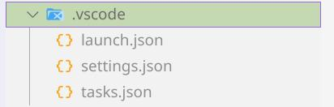
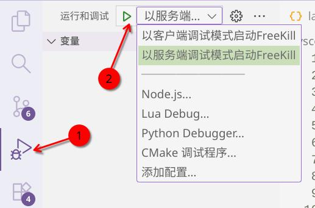
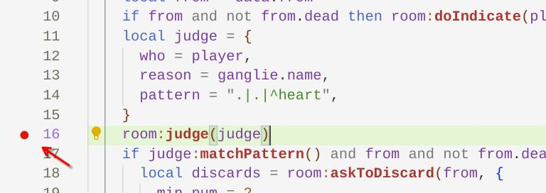
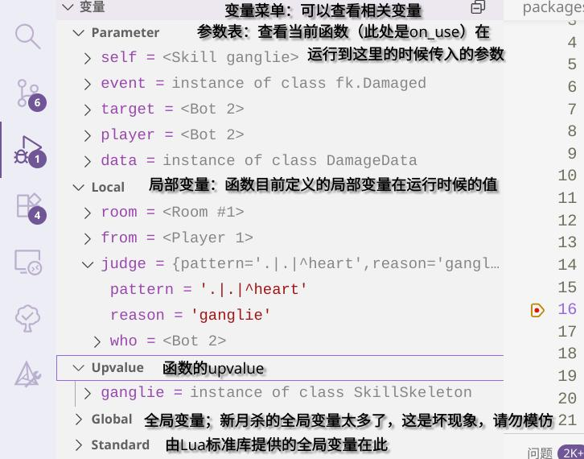
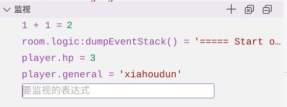
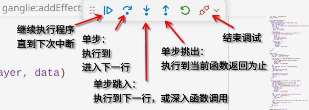

.. SPDX-License-Identifier:	CC-BY-NC-SA-4.0

技巧：调试您的代码
==================

Lua是一门很不错的语言。然而，其在调试上却稍有困难。网上或许能找到一些针对独立运行的Lua脚本的调试器（例如vscode能下载的到的各种Lua debugger），但却不适用于FK。

因此，本文将试图为你扫清Lua调试方面的障碍。

假设你正使用Windows系统，那么启动FK的时候，应该是一个游戏窗口+一个黑色的命令行窗口。调试工作基本就是在黑色窗口进行的。

使用debugger.lua
----------------

这是比较简单的调试方法，FreeKill在lib中引用了debugger.lua作为调试库。

以下只简要介绍一下用法，最详细的详情请去项目官网查看： https://github.com/slembcke/debugger.lua

当你想要在代码中下断点时，就调用 ``dbg()`` 函数。当执行到这里时，就会停下来并在命令行中显示类似gdb的界面。

例如：

.. code:: lua

   local room = player.room

   dbg() -- 相当于下了断点，后面就可以来此进行调试
   player:drawCards(1)

上面的代码中就调用了debugger.lua，让程序进行了中断，然后命令行就进入了调试界面。

.. hint::

   在默认的双击启用exe带有的命令行中，颜色可能会显示的非常奇怪。

   如果你遇到了颜色不能正常显示的问题，推荐你使用Git Bash或者Windows Terminal之类的终端模拟器，然后在命令行中通过FreeKill.exe来启动游戏。

下面来说说调试的基本用法：使用 ``h`` 命令显示帮助信息。debugger.lua已经被我中文化了。

.. tip::

   其实也可以用lua自带的 ``debug.debug()`` 进行交互式调试，不过功能比debugger.lua弱得多了。

.. warning::

   在Linux上使用FreeKill -s开服时不能用这个调试器！因为stdin已经被服务端shell占用了，所以无法调试。

利用VSCode的Lua调试插件进行调试
--------------------------------

更加便利且直观的办法是利用VSCode中的Lua调试器插件来进行调试。首先下载actboy168的Lua Debug插件：

然后在工作区下（请确保工作区是FreeKill游戏目录，也就是含有FreeKill.exe那个目录）找到.vscode文件夹，
没有就新建一个，在其中创建launch.json和tasks.json两个文件（图中settings.json是我自己的配置）：

首先在tasks.json中写入：

.. code:: js

  {
    "version": "2.0.0",
    "tasks": [
      {
        "label": "launch-freekill-client-debug",
        "type": "shell",
        "command": "./FreeKill.exe",
        "options": {
          "env": {
            "FREEKILL_LUA_DEBUG": "client"
          }
        },
        "isBackground": true,
      },
      {
        "label": "launch-freekill-server-debug",
        "type": "shell",
        "command": "./FreeKill.exe",
        "options": {
          "env": {
            "FREEKILL_LUA_DEBUG": "server"
          }
        },
        "isBackground": true,
      }
    ]
  }

然后在launch.json中写入：

.. code:: js

  {
    "version": "0.2.0",
    "configurations": [
      {
        "name": "以客户端调试模式启动FreeKill",
        "type": "lua",
        "request": "attach",
        "stopOnEntry": false,
        "address": "127.0.0.1:5927",
        "preLaunchTask": "launch-freekill-client-debug"
      },
      {
        "name": "以服务端调试模式启动FreeKill",
        "type": "lua",
        "request": "attach",
        "stopOnEntry": false,
        "address": "127.0.0.1:5928",
        "preLaunchTask": "launch-freekill-server-debug"
      },
    ],
  }

保存好两个文件之后，在左侧栏的“运行和调试”页面中会出现新的选项，按需要选择
客户端调试模式或者服务端调试模式，选定完成后按下绿色小三角图标启动任务，
此时游戏会启动。这里以服务端调试模式启动为例。

.. note::

   写作这一段时，由于调试插件本身的一个bug，无法很便利的直接调试所有Lua，
   只好像这样分成两个不同的模式启动。

游戏启动后，选择自己要调试的Lua文件（服务端的话，一般是触发技以及某些其他技能的生效），
例如以标准版技能“刚烈”为例。

鼠标移动到行号数字后，左侧会出现透明红色小点，点击红色点以添加断点：

然后开一局游戏并设法发动刚烈，这样游戏会暂停，编辑器的窗口此时也应当弹出，此时进入调试界面。
调试侧栏中有许多有用的信息，首先，我们可以在“变量”栏中直接查看变量的值，对于table型还可以展开：

我们可能还希望调查一些特定表达式的值，可以通过“监视”栏去查看。点击加号或者双击监视栏下的空白区域，
就可以添加想要查看的表达式的值了。

调试侧栏中其他功能不再详细介绍，剩下需要仔细留意的是位于代码编辑器顶部的调试操作面板，介绍如图：

功能就这么多，祝调试顺利！你也可以在游戏运行的途中，在编辑器中途增加或删除断点，
调试器会为你正常中断的。

当关闭掉游戏程序后，调试就算作结束。

一些在调试中可能有用的函数
--------------------------

debugger.lua的话，在调试器中直接输入Lua语句就能执行。

以下是一些可能用得到的函数：

print
~~~~~

遇事不决print，这是当时没有调试器可用时候的措施。简单但却实用。

现在可以直接用debugger.lua的 p 命令输出表达式的值了，无需再自己写一堆。

p
~~~

``p`` 也是个函数，是inspect库的包装。它能详细输出表中的所有值，包括元表。

因此在使用它输出和类相关的东西的时候还是放弃为好...

json.encode
~~~~~~~~~~~

将不含循环引用的表转换为json字符串。或许会很有用吧。但是不如p就是了。

GameLogic:dumpEventStack()
~~~~~~~~~~~~~~~~~~~~~~~~~~

输出当前的事件栈。在处理插结的时候能派上用场。
