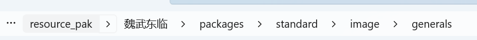

创建资源包
============
新月杀武将的原画资源和语音资源也是可以进行替换的，你可以先准备好相应的图片和音频资源。

研究一下新月杀的项目结构，不难发现在新月杀根目录FreeKill-release下，曹操原画和各个语音的相对路径如下：

::

   packages\standard\image\generals\caocao.jpg
   packages\standard\audio\skill\jianxiong1.mp3
   …………（其它技能语音相对路径）
   packages\standard\audio\death\caocao.mp3

按照终点的资源文件对之前准备的图片音频资源进行重命名后，在根目录下新建文件夹命名为resource_pak，新建资源包文件夹，为它取个名字，再按照刚才的相对路径建好文件树，放置终点文件可以了。

.. note::

   在单个资源包目录下，单独准备一个icon.png能为你的资源包在游戏目录中显示一个logo图。

进入游戏，这个时候就能看见我们的资源包了，点击启用并保存，进入服务器，查看武将列表，你创建的资源包就被应用啦。

.. note::

   package目录下的图片和音频资源，甚至qml文件都是能通过这样的方法进行替换的，多多尝试创建个性化资源吧。也欢迎你将自己的资源发送到群聊中与大家分享。新月杀美化群：964416496。
