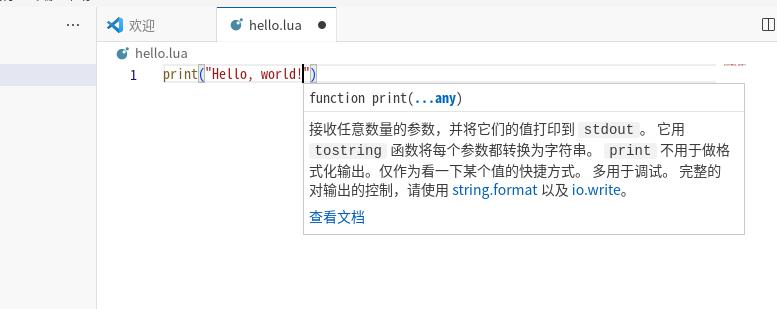
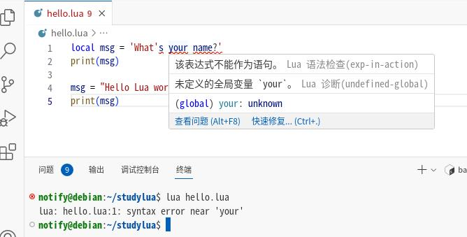

Lua：变量与简单的数据类型
==========================

这篇文章中我们来了解一下在Lua中会使用到的种种数据，
以及学习如何将数据保存到变量中，在程序中如何使用这些变量。

关于hello.lua
---------------

书接上回，我们编写了第一个hello world程序：

.. code:: lua

   print("Hello, world!")

首先看文件的名字hello.lua。文件的末尾是.lua，表示这是一个Lua程序。只有Lua程序才能被 `Lua解释器` 执行。
当你输入 ``lua hello.lua`` 执行的时候，Lua解释器先读取整个程序，确定每个单词和字符的含义，随后执行它。
例如，print是打印的意思，于是Lua解释器就将 Hello, world! “打印”到了屏幕上。

在我们用文本编辑器编写程序的时候，编辑器会用不同的颜色显示程序的不同部分。还是拿这个图举例：

   我们的第一个程序hello.lua

得益于Lua插件，vscode能够知道我们代码的含义。比如，它知道\ ``print``\ 是一个\ `函数`\ 名，
于是将其显示为棕色；他也知道 "Hello world!" 不是Lua代码，所以改为橙色显示。
这种通过颜色的不同显示代码不同部分的功能就称为\ **语法突出**\ ，这个功能相当好用。

变量
-----

好，然后我们在hello.lua新增一个变量吧。首先在文件开头新增一行代码，然后再对第二行做出修改，
让你的代码看起来如下：

.. code:: lua

   local msg = "Hello world!"
   print(msg)

再运行一下，你会发现他输出的依然是“Hello world!”。

在刚刚的代码中，我们创建了一个名为\ ``msg``\ 的\ **变量**\ 。变量就是用来储存一个值的东西；
在这段代码中，变量\ ``msg``\ 的值是\ *字符串*\ “Hello world!”

添加了变量之后，Lua解释器执行代码的方式也有所不同。在处理第一行代码的时候，它将文本
“Hello world!”和变量\ ``msg``\ 联系起来；在处理第2行代码的时候，就把和 ``msg`` 关联的那个值打印到屏幕。

好了，我们接下来再多写几行代码，修改hello.lua让他再多打印点东西。我们在末尾先添加一个空行，
然后再添加下面两行代码：

.. code-block:: lua
   :emphasize-lines: 4,5

   local msg = "Hello world!"
   print(msg)

   msg = "Hello Lua world!"
   print(msg)

别忘了保存了，现在运行的话，可以看到如下的输出：

::

   Hello world!
   Hello Lua world!

在程序中随时都能修改变量的值，Lua会帮你记录变量最新的值。

在Lua中使用的变量的时候需要遵守一些规则和提示。违反规则的话会报错，
而其他提示目的在于让你的代码更容易让人阅读和理解。以下几点请好好记住：

- 变量名字只能包含字母、数字和下划线（_）。变量名可以用字母和下划线开头，但是不能用数字开头。
  比如你可以试试用msg0当变量名，但是用0msg当变量名的话就会引发错误。
- 变量名不能含有中文，也不能带空格。这个是第一条说过的——只能使用英文字母和数字哦。
- Lua语言的关键字不能用作变量名！以及像print这样的有特殊用途的词也不要当变量名。
- 变量名应该简短又不失描述性，比如msg就比m要简明（虽然写成message估计会更不错）。

总之，想要创建好的变量名，需要通过实践积累。随着你自己写的代码量以及阅读他人代码的数量增多，
你将越来越善于创建有意义的变量名。

.. hint::

   就当前阶段而言，我们都应当用纯小写字母和下划线命名变量；虽然大写字母不会报错，
   不过避免用大写字母当变量名总会不错。

字符串
------

大多数程序都定义并收集某种数据，然后使用它们来做些有意义的事情。鉴于此,对数据进行分类大有裨益。
我们将介绍的第一种数据类型是字符串。字符串虽然看似简单，但能够以很多不同的方式使用它们。

字符串就是一系列字符。在Lua中，用引号括起的都是字符串，
其中的引号可以是单引号，也可以是双引号，如下所示:

.. code:: lua

   local msg1 = "这是字符串"
   local msg2 = '这也是字符串'

.. warning::

   虽然说用引号括起来的文本都是字符串，但是这里的引号必须是英文的引号（"和'）！
   用中文输入法的话很容易输入中文引号（“”或者‘’），这样会导致Lua直接报错的。
   
   以后如无特殊说明，默认都是使用半角的英文符号而非全角的中文符号。

拼接字符串
~~~~~~~~~~~

在很多情况下都需要拼接两个字符串，比如“OL界黄忠”，你可能想要把“OL界”保存在一个变量，
把“黄忠”保存在另一个变量，等到要显示全名的时候再将他们合二为一：

.. code:: lua

   local olj = "OL界"
   local hz = "黄忠"
   local full = olj .. hz

   print(full)

在Lua中，使用一个专门的连字运算符（ ``..`` ）来拼接字符串。在这个例子中，我们使用..
来合并“OL界”和“黄忠”，使得程序能打印出完整的名字“OL界黄忠”。

像这种合并字符串的方法就称为 `拼接` 。通过拼接就能利用多个变量中的信息创建一个完整的信息。
比如我这么改：

.. code-block:: lua
   :emphasize-lines: 5

   local olj = "OL界"
   local hz = "黄忠"
   local full = olj .. hz

   print("Hello, " .. full .. "!")

在这里，我们利用字符串拼接，将Hello和感叹号拼接到名字的前后，形成了一条问候语：“Hello, OL界黄忠!”

避免语法错误
~~~~~~~~~~~~~

`语法错误` 是一种时不时会遇到，但是很容易修改的错误。程序中包含不符合语法规范的Lua代码的时候，
就会导致语法错误。例如，在单引号括起来的字符串中，如果含有撇号，那么就会引发错误。
这是因为Lua将第一个单引号和撇号之间的内容视为一个字符串，
进而将余下的文本视为Lua代码，从而引发错误。

例如我们把hello.lua这么改：

.. code:: lua

   local msg = "What's your name?"
   print(msg)

运行一下的话，程序会正确的输出字符串。但如果我把这个字符串改成单引号括着的：

::

   local msg = 'What's your name?'
   print(msg)

运行一下，Lua不会输出了，而是产生报错：

::

   lua: hello.lua:1: syntax error near 'your'

这告诉你在hello.lua的第一行的your附近存在语法错误。

得益于Lua插件，当你写出语法错误的时候，编辑器应该能够立刻帮你揪出来，如图：

   红色波浪线标记的错误

当出现语法错误的时候，编辑器会自动把出错的地方标上红色波浪线。
将鼠标移动到红色波浪线即可看到报错内容，此时请仔细分析问题出在哪了。

数字
-----

在编程中，数字自然也是必不可少的一种类型了，我们就是直接用数字表示角色体力值等等。
鉴于在新月杀中几乎用不到\ `浮点数`\ （术语，指的其实就是小数），我们这里就简单看看整数。

在Lua中，可以对数字进行加（ ``+`` ）减（ ``-`` ）乘（ ``*`` ）除（ ``/`` ）运算。我们来操练一下吧，
在终端中直接输入 ``lua`` 命令即可进入交互式环境：

.. note::

   使用无参数的lua命令即可进入交互式环境。所谓的交互式环境就是，
   你输入一个式子或者一些代码，Lua能够为你计算出式子的结果或者执行代码，
   然后将结果输出到屏幕上。如果想退出Lua交互式环境的话，按下Ctrl+C组合键即可，
   这样Lua就会退出了。

::

   > 2 + 3
   5
   > 4 - 1
   3
   > 4 * 7
   28
   > 5 / 3
   1.6666666666667

Lua遵循从左到右、先乘除、后加减的原则对表达式进行求值。不过你也可以使用括号来自定义运算顺序。

::

   > 3 + 5*4
   23
   > (3 + 5) * 4
   32

在这些例子中，空格不影响Lua计算表达式，它只是为了让你在阅读的时候更加容易确定计算顺序。

注释
-----

几乎所有编程语言都带有\ `注释`\ 功能。注释的作用旨在帮助人类阅读并理解代码，
随着程序越来越复杂，很多时候需要添加注释以进行必要的说明。

如何编写注释
~~~~~~~~~~~~

在Lua中，注释用两根横杠或者两个减号（ ``--`` ）标识。在两个减号后的内容会被直接忽略，例如：

.. code:: lua

   -- 向世界问好吧
   print("Hello world!")

Lua解释器会直接忽略第一行，只执行第二行。

该编写怎么样的注释
~~~~~~~~~~~~~~~~~~~

编写注释的主要目的是阐述代码要做什么，以及是如何做的。在编程期间，
你对各个部分如何协同工作了如指掌，但过段时间后，有些细节你可能不记得了。
当然，你总是可以通过研究代码来确定各个部分的工作原理，
但通过编写注释，以清晰的自然语言对解决方案进行概述，可节省很多时间。

想要编写优秀的拓展或者和其他拓展作者合作、交流，就必须编写有意义的注释。
回答问题的人们都希望代码中包含注释，因此你最好从现在开始就在程序中添加描述性注释。
作为新手，最值得养成的习惯之一是，在代码中编写清晰、简洁的注释。

从这以后，涉及的示例都将使用注释来阐述代码的工作原理。
