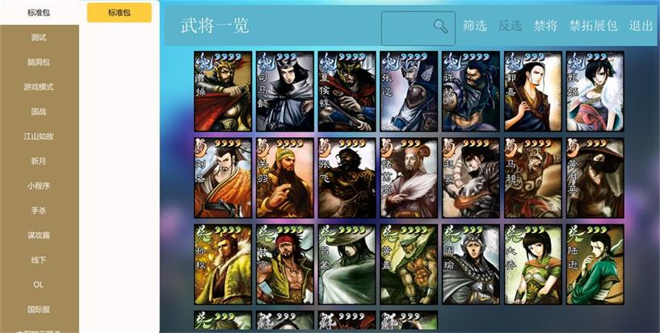

禁将设置
=============

在创建房间时，我们往往需要设置将池来控制会出现的武将，禁用的武将将不会出现房间的选将框内。当然了，仅限于你创的房间。
新月杀支持保存你的禁将方案

在大厅界面，我们可以点击“武将一览”来进入武将图鉴并在这里设置禁将

  武将一览界面

点击“禁将”，然后点击武将图片，我们可以将某个具体的武将禁用，再次点击禁用的武将可以重新启用。

点击“禁拓展包”，我们可以对某个小包进行整体禁用（即位于第二列的分包），操作逻辑同上。

.. hint::
  新月杀会不定期更新新的武将，所以需要经常管理自己的禁将方案，由于新武将默认开启（除非新武将位于某个被禁用的分包），
  所以你需要手动禁用ta