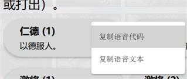

常见疑问
============

介绍一些比较散乱的、但是玩家最好知道一下的事项。
   
语音代码
-----------

在聊天框输入一些特殊字符后可以向房间内发一句台词，此谓语音代码，想必大家都
听到过了吧。在新版本中，快捷语音聊天中会出现选择武将的快捷语音台词哦~

发送技能语音
~~~~~~~~~~~~

技能语音代码格式很简单，如下：

::

  $<内部技能名>:<语音编号>

所谓内部技能名就是技能在程序代码里面的变量名。绝大多数情况下这种变量名直接就是
技能的拼音。而语音编号指的是要发送哪句台词，几乎所有技能都有两句或者以上的\
台词，这个编号就表示着台词的序号。举个例子：

::

  $fushi:2

这个意为发送技能“缚豕”（OL吕伯奢）的第二句台词。

.. hint::

   “今儿个呀，咱们吃油汪汪的猪肉！”

也有些技能只有一句台词，这种情况下将序号写为0即可。

也有些技能存在着同名现象，也就是著名的同名不同版本。这种情况下它的内部名称\
一般就是前缀__拼音的形式（注意有两根下划线），例如luoyi是标裸衣，
ex__luoyi才是界裸衣。实在不行可以开vscode进行全局搜索台词。

阵亡语音
~~~~~~~~~

阵亡语音的格式如下：

::

  $~<武将内部名>

武将内部名和技能内部名同理。

技能语音-进阶
~~~~~~~~~~~~~

有些技能存在着不同武将不同表现的现象，比如标吕布和界吕布的无双，虽然是同一\
技能但是台词却不相同。欲为这种技能指定特定武将的配音，使用这种格式吧：

::

  $<技能内部名>:<序号>:<武将内部名>

这样一来就播放对应武将的语音了，这种在宗族技中最为常见。

常见问题解答
----------------

会不会有皮肤系统？
~~~~~~~~~~~~~~~~~~~

不会。这是为了保持游戏本身精简。

能不能把击破特效关了啊？
~~~~~~~~~~~~~~~~~~~~~~~~~

不能，这是由服主管理的。如果你是私服服主的话，不安装mobile_effect拓展即可令\
这种手杀风格的全屏大特效全部消失。

常见错误
-----------------

 .. hint::
  1.【从旧版本升级注意事项】推荐从旧版本升级的玩家先在“管理扩展包”中将freekill-core禁用，重启游戏，再进入服务器更新，否则会出现持续报错。

1. Workspace is dirty
~~~~~~~~~~~~~~~~~~~~~~~~~~

哪个包报错就在主界面管理拓展包删掉那个包

2. 报错包含Http xxx 400
~~~~~~~~~~~~~~~~~~~~~~~~~~~~

换网络并重启游戏

3. 报错包含syscall failure
~~~~~~~~~~~~~~~~~~~~~~~~~~~~~~~

重启游戏

4. 报错包含no such file or directory
~~~~~~~~~~~~~~~~~~~~~~~~~~~~~~~~~~~~~~~~~

在主界面管理拓展包删除那个包、然后去文件管理器（手机的话MT管理器）找到游戏目录下packages/文件夹、删除和拓展包同名的文件夹

5. 报错包含“没有那个文件或目录”
~~~~~~~~~~~~~~~~~~~~~~~~~~~~~~~~

同上（注意仔细看报错内容包含内容）

6. 【电脑版无法单机启动】
~~~~~~~~~~~~~~~~~~~~~~~~~~~~~~~~

尝试使用最新的版本

7. 更新完点击“已完成”，关闭游戏后再打开会黑屏
~~~~~~~~~~~~~~~~~~~~~~~~~~~~~~~~~~~~~~~~~~~~~~

这个是由于关闭按钮需要一定时间关闭应用后台，所以可以在点击按钮后等一会再进游戏，或者黑屏后直接重启游戏即可。

8. 禁将UI点不了
~~~~~~~~~~~~~~~~~~~~~~~~~~~

去武将一览右上角禁将

9. 如图
~~~~~~~~~~~~~~~~~~

.. figure:: pic/8-2.jpg
  :align: center

非常常见的Bug报错，原因是某个扩展包出了问题。解决方案：删除所有扩展包并重新进入服务器，如果还出现此类问题，卸载重装。

10. 如图
~~~~~~~~~~~~~~~~
  
.. figure:: pic/8-3.jpg
  :align: center

非常常见的Bug报错，原因是指定的扩展包出了问题。

解决方案：在主界面管理扩展包中，找到前缀为括号内代码的扩展包，例如abc(4d955)，找到abc扩展包，查看后缀为报错代码中，括号内代码的前几位，删除abc，重进服务器。

再出现此类问题，删除全部扩展包，如果还没用，卸载重装。

11. 如图
~~~~~~~~~~~~~~~~
  
.. figure:: pic/8-4.jpg
  :align: center

非常常见的Bug报错，原因是更新中发出报错。

解决方案，等待更新完毕，直接进入服务器。如果有问题，则找到报错图文中packages/字样，删除其后面的扩展包。例如本图内是packages/mini/出现问题，在主界面管理扩展包中，找到mini并删除。

再出现此类问题，删除全部扩展包，如果还没用，卸载重装。

12. 如图
~~~~~~~~~~~~~~~~
  
.. figure:: pic/8-5.jpg
  :align: center

某次版本更新后出现无法选择武将的问题，原因是某次版本的界面UI更新。

解决方案：退出游戏并重连即可。

