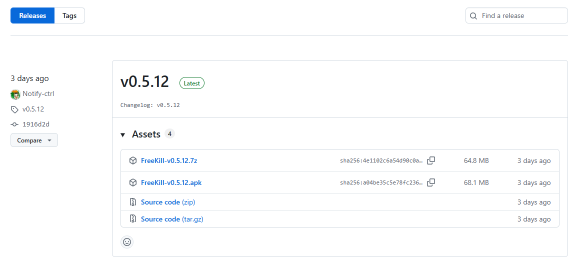
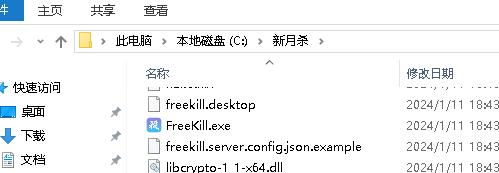

快速上手
==========

.. todo::

   本文所述内容已过时，欢迎贡献者

如何下载
---------

新月杀可以在github或者gitee的发行版页面下载。

https://github.com/Qsgs-Fans/FreeKill/releases

https://gitee.com/notify-ctrl/FreeKill/releases

这两个网站按理说是稳定的下载源。不过github可能需要点科技。

如果想要直达某个下载页面，可以在网站后加上 ``/tag/v<版本号>`` ，
这样就直接到了那个版本的下载地址。

比如：

::

  https://gitee.com/notify-ctrl/FreeKill/releases/tag/v0.3.1

接下来以gitee为例讲解如何下载。

进入页面后，网页是这个界面：

   下载页面的说明

安装安卓版
~~~~~~~~~~~

点击FreeKill-vx.x.x.apk即可下载，就是apk结尾的那个。

注意到比较常见的问题就是下载的明明是apk但是下载完成后变成了zip文件。
对于这种情况只能自己下载类似ZArchiver或者MT管理器之类的软件，
然后手动将xxx.zip重命名为xxx.apk，这样就能安装。

安装PC版
~~~~~~~~~~~

点击FreeKill.vx.x.x.7z即可下载PC版。

这里不讲解如何解压缩，解压缩之后是名为FreeKill-release的文件夹。
自己找一个地方用来安放新月杀数据吧，这里更名为 C:\新月杀，如图：

   PC版需要自己放到一个文件夹

这个文件夹就作为游戏常驻文件夹了，后续的其他教程都把新月杀本体放在这里。
大家也可以自己选择游戏的文件夹，不过其实不建议放在C盘。

双击FreeKill.exe即可运行。

如何更新
----------

新月杀主要玩法就是依靠服务器联机（后面说明），而联机的基本条件是和服务器
保持版本一致。这就有一个如何更新的问题了。

当无法连接服务器时，屏幕底部会弹出错误信息，有些可能就是提醒你更新：

.. figure:: pic/2-3.jpg
   :align: center

   版本更新提示

这种情况下，按照前面说的办法下载一个版本符合的新月杀并安装。

安卓版的更新
~~~~~~~~~~~~~~

下载新的APK，然后直接覆盖旧版安装即可。

PC版的更新
~~~~~~~~~~~~~~

下载新的7z包，解压出其中的FreeKill-release文件夹，将文件夹中所有文件复制到
游戏文件夹即可（如C:\新月杀)，这样就完成了覆盖式更新。

.. warning::

   如果不进行覆盖式安装的话，你会丢掉所有保存的信息，比如记住的密码、禁将方案等等！
   而且还需要重新下一堆包，因此切记要覆盖文件夹安装！
