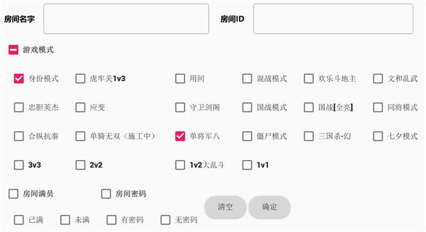

大厅说明
==========

现在你总算加入服务器了，可喜可贺。

   大厅界面

加入服务器后，你首先会进入服务器大厅。下面粗略介绍一下大厅的玩法。

- 左上角是你的头像，点击即可进行一些简单的设置，比如修改头像、更改游戏背景与音乐等。
- 右下角是大厅聊天界面，可以在此打字聊天，请注意不要有过激言论和非法言论，否则将遭到封禁。
- 中间一块区域是房间列表，可以在此加入房间或者旁观房间。
- 右下方还有一系列可以操作的区域，把每个按钮都按一下试试看吧。
- 右上方可以对大厅的房间按照模式或名字进行筛选，也可以创建自己的房间。
- 点右上角离开大厅，此时你就退出服务器了。
- 左上角是你的头像，点击即可进行一些简单的设置，比如修改头像、更改游戏背景与音乐等。
- 右下角是大厅聊天界面，可以在此打字聊天，请注意不要有过激言论和非法言论，否则将遭到封禁。
- 中间一块区域是房间列表，可以在此加入房间或者旁观房间。
- 右下方还有一系列可以操作的区域，把每个按钮都按一下试试看吧。
- 右上方可以对大厅的房间按照模式或名字进行筛选，也可以创建自己的房间。
- 点右上角离开大厅，此时你就退出服务器了。

有些东西需要用单开文章详细介绍，这里就提一下简单点的。

自己的头像
----------

点击后弹出一个简单的设置界面，可以修改自己的头像、密码。

注意屏幕最左侧可以切换设置页面。如果你注意到了的话，那么你就可以修改游戏背景、调节BGM音量了。

关于如何修改头像，有三种方法，这里一一进行介绍。

第一种，简单的输入武将名称拼音。

例如，标刘备对应【liubei】，在头像的输入框中输入liubei，再点击右侧的【更新头像】按钮，即可看到自己的头像变成了标刘备，其他标包或者单独名称的武将都可以使用拼音。

   在个人界面设置头像

有的武将代码名称可能不是拼音，例如界刘备，谋马超等输入liubei或者machao都是标包，此时就可以使用第二种方法了。

第二种，从武将一览里面找。

在大厅的下方有武将一览按钮，点进去找到自己心仪的武将，点击武将后会展示武将的详细UI，在这个UI的左下角会有一个【设为头像】按钮，点击后直接就会更新头像啦。

   在武将界面设置头像

第三种，使用武将代码名称。

每个武将都有属于自己独一无二的代码名称，在头像输入框中输入武将的代码名称就可以啦。

那么问题来了，怎么找到武将的代码名称呢？这就需要去找到武将的代码，安卓端使用mt管理器或者文件目录，电脑端打开游戏目录。

具体路径可以看新手入门中的详细指引。例如，如果我想找到界刘备的代码名称，这里从standard_ex包里面找到界限突破·标准包，之后寻找Fk:loadTranslationTable{}函数，从这里就能看到武将名所对应的英文代码了。

["ex__liubei"]="界刘备"。在这串代码中，界刘备武将的代码名称就是ex__liubei，我们在头像的输入框里面输入ex__liubei，点击【更新头像】按钮就可以了。

三种方法各有千秋，武将拼音适合刚接触三国杀或者新月杀的小伙伴。
武将一览中的设为头像方法适合已经接触新月杀一段时间的玩家。
武将代码名称则是适合新月杀的开发者。
在服务器上的玩家仅能使用服务器已经开启的扩展包，别的服务器如果有开扩展包而当前服务器没有这个扩展包的话，会令头像变成默认的无角色头像。

PS:新玩家的头像默认是标刘备，人机的头像默认是标关羽。

聊天
-----

聊天可以在游戏大厅，游戏房间内下方找到。聊天区域有聊天历史记录，聊天输入框，右侧是聊天表情与聊天发送按钮。

在游戏房间内聊天在左下角，同时新增快捷短语发送。

在游戏房间内，可以发送武将的技能语音与阵亡语音，不过你需要知道武将技能的代码名称，寻找方式与上文头像栏所介绍的武将代码名称类似。

先找到武将代码名称，再从中找到武将的技能代码名称。

具体规则请跳转本章09节--杂项小知识

发送武将语音代码仅在游戏房间内生效，在游戏大厅里面发送是没有效果的。

房间列表
---------

此列表显示着服务器所有的房间。对于人数有空余的房间可以坐下参与对战，
人已经满了的房间就只能观战咯。

在服务器中，可能会出现尸体房的情况，例如等待房间内人数为8/4，5/4，或者已经开始且没有上锁，但是无法进行观战的情况。
这种等服务器刷新都会消失的，目前尚未定位这个bug是怎么产生的。

房间列表不会自动刷新，不过顶部提供了一个刷新房间列表的按钮和筛选按钮。你可以通过刷新或定向筛选找到你的好朋友创建的房间！

   筛选房间

服务器信息
-----------

屏幕右侧显示着服务器的自我介绍和相关的公告，以及新月杀本体的版本更新说明。

右下角的那些按钮
-----------------

- 武将一览、卡牌一览、玩法一览：查看服务器提供的武将、卡牌、游戏模式玩法。

.. figure:: pic/4-5.jpg
   :align: center

   武将一览界面

在武将一览中，最左侧是扩展名，中间的白色部分是小包名称，右侧则是武将。每个扩展包包涵了多个小包，每个小包里面包含了各有特色的武将。

上方的武将一览框，右侧包含了多个功能。右侧输入框输入武将中文名称，然后点击搜索就可以找到武将了。或点击筛选进行更高级的搜索。

在点击某个武将时会出现其的详细UI，在武将详情中，可以看见武将的势力，体力，左下角的设计者与属于哪个扩展包，还有设为头像按钮。
右侧是技能描述、技能与阵亡语音。

在卡牌一览中不能对单个卡牌禁止，也不能禁扩展卡牌包。

在玩法一览中可以看见各个玩法的详细介绍。

- 录像：回放保存的录像。
- 关于：查看新月杀主程序的自我介绍吧。看看是谁制作了这款游戏。
- 创建房间：创建自己的房间吧。
