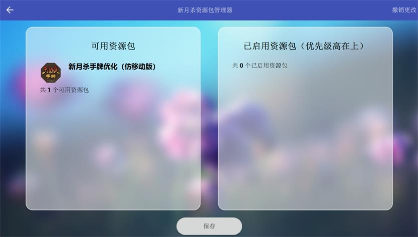

资源包说明
=============

新月杀目前支持导入资源包替换一部分游戏内的美术资源（武将原画和手牌等）。
这种替换只是单纯替换客户端的显示画面，完全是本地资源的更改。

如果你下载了可用的新月杀资源包，你可以将其导入新月杀进行使用

导入方法
------------

桌面端（Windows/Linux）
~~~~~~~~~~~~~~~~~~~~~~~~~~~~~~

将压缩包解压后放在新月杀位置的 ``resource_pak`` 文件夹下，如果没有则你需要自己创建一个 ``resource_pak`` 文件夹。
并保证其图标文件 ``icon.png`` 位于：

  ``./resource_pak/<资源包名字>/icon.png``

移动端（安卓）
~~~~~~~~~~~~~~~~~~~~~~~

同样的，将压缩包解压后放在新月杀位置的 ``resource_pak`` 文件夹下，位置在 ``Android/data/org.notify.FreeKill/files/``。
没有则创建一个 ``resource_pak`` 文件夹。并保证图标文件 ``icon.png`` 位于：

  ``Android/data/org.notify.FreeKill/files/resource_pak/<资源包名字>/icon.png``

.. hint::
  许多手机需要你进入原生文件管理器才能够访问 ``Android/data/`` 下的文件夹，你可以搜索对应手机型号的手机如何访问原生文件管理器

使用方法
---------------

如果资源包被顺利导入，在游戏开始界面点击管理资源包就能够看到导入的资源包了：

  资源包管理器界面

直接点击导入包，其会变成启用状态，这时点击下方的保存按钮后就能使用资源包啦

.. hint::
  你可以同时启用多个资源包，位于上方的资源包会覆盖下方的资源包。你可以通过按钮调整已启用
  资源包的优先级