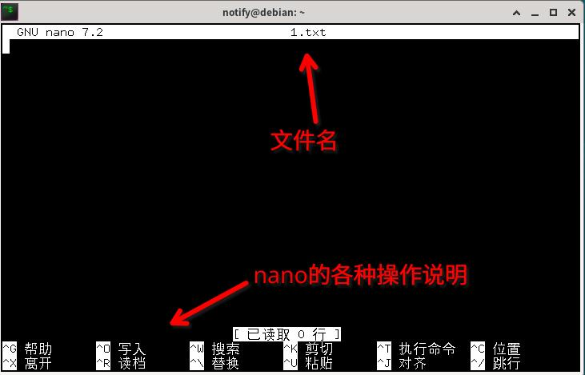
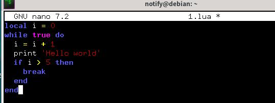
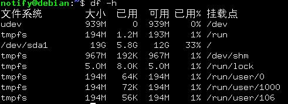
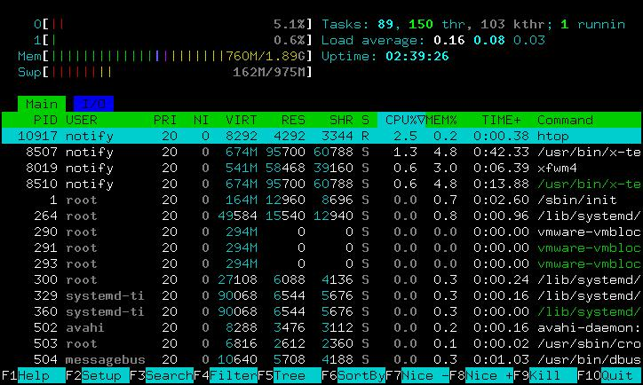

操练：Linux的更多基本使用
==========================

上篇文章虽然已经提及了部分Linux使用，但这还不够。接下来将继续讲述其他的使用办法，比如编辑文件、复制文件和移动文件等等。

先准备就绪吧：打开终端。现在处于自己用户的家目录（/home/notify，具体取决于你的用户名）

更多文件操作
~~~~~~~~~~~~~

编辑文件
---------

欲编辑文件，需要使用 ``nano`` 命令，没有就安装一个。我们还要有个文件来编辑呢，用touch命令创建一个。这里来创建个1.lua文件来编辑。

::

   $ nano 1.lua

这个命令之后，shell的界面消失不见，整个终端变成了nano的界面。

   nano文本编辑器

启动nano后，直接打字输入内容就行了，用键盘的上下左右键来移动输入光标的位置。除了光标用上下左右移动之外，其他打字方面应该是很容易的。

   直接输入内容就行了

接下来保存退出吧。注意下方类似 ``^O`` 的说明，这个的意思是 ``Ctrl+O`` 组合按钮。根据说明， ``^O`` 对应的是写入，也就是保存到文件里面，所以我们按下 ``Ctrl+O`` 保存，询问要保存的文件名的话就直接回车。再根据说明内容，用 ``Ctrl+X`` 退出nano。

退出nano之后我们又回到了Shell的界面，命令提示符也出现了，继续用新的命令操作吧。

让我们确认一下是否真的保存到1.lua里面了。在文件管理器双击就能打开（默认居然是用word打开，过于炸裂），不过因为是介绍终端使用，我们最好还是用命令查看文件的内容。

用 ``cat`` 命令可以将文件的内容打印出来，需要带一个参数。使用命令 ``cat 1.lua`` 就能把文件的内容显示到屏幕了。当然用nano再次打开文件查看也可，看完了按Ctrl+X退出。

复制文件
---------

现在已经有个编辑了的1.lua了，我想把他复制一份2.lua的话，要用到 ``cp`` （copy）命令。

``cp`` 命令需要带两个参数；参数1是要复制的文件名字，参数2是复制目标的文件名。

::

   $ cp 1.lua 2.lua

复制成功后没有显示，用ls查看结果吧。为了确定是否真的复制了，可以用cat查看2.lua的内容。

``cp`` 命令也可以把文件复制到另一个文件夹中，此时参数2填入文件夹的名字就行。

::

   $ mkdir l
   $ cp 1.lua l
   $ cp 2.lua l

以上的命令先创建文件夹l，再把两个lua文件复制到文件夹l中。这些命令全都没有输出，用ls命令查看吧。

.. hint::

   这里涉及查看文件夹l中的内容了。有两种办法，一种是像文件管理器那样，双击打开文件夹l查看，看完了返回上层目录；这种做法用命令来做就是先 ``cd l`` ，再ls，然后 ``cd ..`` 回到原先的目录。另一种办法就是给ls命令上个参数；ls命令接受文件夹作为参数，当有参数的时候，就列出参数那个文件夹中的文件，没有参数的时候就列出当前目录。也就是说这里还可以用 ``ls l`` 命令直接查看文件夹l里面的内容。

``cp`` 命令还能复制文件夹，像 ``rm`` 那样，复制文件夹的话要带上-r参数。自己尝试吧。

移动文件
---------

移动文件使用的是 ``mv`` 命令，用法与cp一致。

不过有一点除外：用mv移动文件夹的时候不需要带上-r。

整合一下：我们已经了解了列出、新建、删除、编辑、复制、移动文件了，此时文件的操作基本上就这么多了。更多的文件操作可以从网上查询，我们知道这么多已经足够开新月杀服务器了。

成为见习系统管理员
~~~~~~~~~~~~~~~~~~

身为服主，自然要能对系统有所了解。这里介绍一些关于了解系统运行情况的命令。

首先是单走一个 ``df`` 命令，他能列出磁盘使用情况。推荐带一个-h参数这样输出结果更容易阅读。

   df命令，/dev开头的就表示这个磁盘了

然后是 ``htop`` 命令，可以查看cpu使用、内存使用、进程列表等等。htop的界面可以使用鼠标点击操作，当然界面的操作提示也非常详尽。

   htop命令的界面
