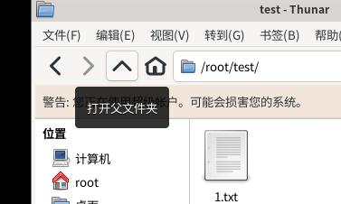
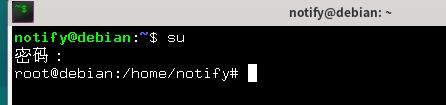

操练：Linux的基本使用
======================

我们最终是要在服务器里面操作的，而服务器并不像我们安装虚拟机那样还带一个桌面，服务器只有纯命令行（也称为终端）。所以，我们现在就利用虚拟机操练一下命令行的使用办法。不必对命令行产生畏惧心理，和图形界面一样，终端也是操作电脑的方法之一。

这些文章只会对Linux做一个浅尝辄止的解释；想要更深入学习的话得去自行搜索资料。

.. hint::

   要学习Git bash的命令行操作的话一样的可以看这篇文章。

在屏幕下方面板单击，这样就启动了终端模拟器。

.. figure:: pic/11-1.jpg
   :align: center

   启动终端模拟器

.. figure:: pic/11-2.jpg
   :align: center

   终端模拟器

这个黑色窗口就是我们的练兵场了。不同机器上可能会有一些细节上的不同，但总体而言应该都是像这样的一个黑窗口。

这个黑色窗口里面运行的程序就是所谓的shell了——严格来说，这个程序的名字叫bash，不过后面还是笼统的称为shell。在shell中你可以通过输入各种命令来操作电脑。

在终端模拟器里面，使用 `Ctrl+Shift+C` 复制文字， 使用 `Ctrl+Shift+V` 粘贴，使用鼠标滚轮可以滚动窗口。

先说明一下，后面关于命令行的讲解都会像这样：

- '$' 开头的文字就是要输入的命令，比如 ``$ ls`` 意为在终端里面输入'ls'并回车。
- '>>>' 开头的文字是终端的输出。比如 ``>>> 公共 模版 视频 图片 文档 下载 音乐 桌面`` 意为终端输出了 >>> 后面的那些文字。

::

  $ ls
  >>> 公共 模版 视频 图片 文档 下载 音乐 桌面

对应终端的截图如下：

.. figure:: pic/11-3.jpg
   :align: center

.. note::

   所谓“命令”指的是一种特殊的关键词，在终端中输入命令就能执行对应的程序。这就类似双击桌面上的图标执行程序一样，输入命令也是运行程序的方式之一。在终端中我们就是通过输入各种命令来执行各种各样的程序的。

了解了这个之后我们就开始吧。后面就不会再贴那么多截图了。

文件管理
---------

对着图形程序来看的话，操作想必会更加直观，所以我们现在也顺便把文件管理器打开（一样的在屏幕底下那个面板有，点一下打开）。

和文件管理器一样，终端也能对文件进行各种操作，例如打开文件夹、列出文件、创建编辑删除等等，文件管理器能做的终端都能做。我们下面一个个来看吧。

列出文件和文件夹
~~~~~~~~~~~~~~~~

使用命令 ``ls`` （list简写，意为列出）即可列出\ **当前目录**\ 下的所有文件和文件夹。

::

  $ ls
  >>> 公共 模版 视频 图片 文档 下载 音乐 桌面

.. figure:: pic/11-4.jpg
   :align: center

   列出文件

注意 ``ls`` 命令的输出，他列出了所有的文件夹；而文件管理器中刚好也显示着这些文件夹。 ``ls`` 命令就和打开文件管理器一样，能列出当前目录的文件。

.. note::

   所谓\ **当前目录**\ 就是你当前正在查看着的那个目录。（目录就是文件夹的另一种称谓而已）就像文件管理器一样，终端也有一个“当前目录”的概念。当你在文件管理器双击某个文件夹打开它时，当前目录就变成了那个目录；这正和终端的当前目录是一样的。

注意终端的\ **提示符**\ ： ``root@debian:~#`` 。 root是你的用户名；@符号后的debian是这台机器的名字。冒号后面的内容就是终端所谓的当前目录了；井号表示这个终端是root在使用，如果是普通用户的话那么就显示为美元符号。

.. note::

   这里又出来一个新名词：提示符。所谓提示符就是一个普通的字符串，用来提示你是时候继续输入新的命令了。当你看到提示符的时候，就表示上一个命令已经执行完毕了，继续输入新的命令吧。

.. note::

   波浪线的意思就是“家目录”。家目录就是这个用户自己的一块自留地。在Windows系统中，双击“我的文档”打开的文件夹就是Windows系统中的“家目录”。反正就是个普通的文件夹。

这里当前目录被shell显示为波浪线了，有点意义不明；我们接下来使用命令 ``pwd`` （print work directory简写，意为输出当前目录）查看当前文件夹的全称吧，好好看清它的真面貌。

::

   $ pwd
   >>> /root

.. figure:: pic/11-5.jpg
   :align: center

   查看终端的当前目录

注意图中，终端的当前目录是 ``/root`` ，文件管理器的当前目录也是 ``/root`` 。而ls命令列出的文件列表也和文件管理器是一致的，这刚好对得上。

.. hint::

   注意目录名字是用斜杠 '/' 开头的。斜杠的意思是根目录，就类似Windows里面的 C:\、D:\一样，不过Linux系统不像Win里面分C盘和D盘，他只有一个根目录。知道斜杠表示根目录就行了，就是个普通的文件夹而已。

为了后面方便说明，这里先把这些默认存在的文件夹全部删除。去文件管理器把他们全部框起来，右键移到回收站，和Windows下面操作一样的。桌面那个文件夹似乎删不了，算了。

删除完成后再去ls试试，可以看到只剩一个文件夹被列出来了。

总结： ``ls`` 命令可以列出当前目录下的文件； ``pwd`` 可以显示当前目录的完整路径。

创建文件和文件夹
~~~~~~~~~~~~~~~~

接下来我们试试在终端里面新建文件和文件夹吧。

我们用 ``touch`` 命令新建文件，用要创建的文件名字作为\ **命令行参数**\ ：

::

   $ touch 1.txt

这行命令没有输出，但是他确实创建了一个名为1.txt的文件，可以在旁边文件管理器里面看到。

当然了，也可以用ls命令看到，又是个操练ls的好机会。

.. note::

   这里又出来一个名词：命令行参数。是的，命令并不都像ls和pwd那样简单，有些命令需要带上更加详细的参数才行，比如touch命令就需要带上文件名。
   把我们输出的那一行命令用空格分割的话，第一个单词就是要执行的程序名字；后面的每一项分别称为参数1、参数2……以此类推。
   大家也可以试试单走一个touch，看看会发生什么。

创建新文件夹用到的命令是 ``mkdir`` （make directory简写，意为创建文件夹）。和touch类似，他需要一个文件夹名字作为命令行参数，不然不知道要新建的文件夹叫啥。

::

   $ mkdir test

这个命令也没有输出，不过可以从文件管理器中看到有个文件夹被创建了，当然也可以用ls看。

总结： ``touch`` 创建普通文件， ``mkdir`` 创建文件夹，二者都需要一个命令行参数。

删除文件和文件夹
~~~~~~~~~~~~~~~~~

想要删除文件的话，用到的命令是 ``rm`` （remove简写，意为删除）。需要跟上想要删除掉的文件名字作为命令行参数。如果想要删除文件夹的话，还需要多跟随一个 ``-r`` 参数，这个参数放在那里都行（一般放在参数1，文件夹名字放在参数2）。

操练一下：

::

   $ rm 1.txt
   $ rm test
   >>> rm: 无法删除 'test': 是一个目录
   $ rm -r test

rm命令成功执行的话不会产生任何输出，不过可以从文件管理器或者ls命令看出成效。在上面的操练中，试图删除目录test的时候操作失败了（没带上-r参数导致的），这时候rm命令会弹出操作失败的提示。

打开新文件夹、返回上级目录
~~~~~~~~~~~~~~~~~~~~~~~~~~~

最后我们操练一下切换当前目录。切换目录使用的是 ``cd`` 命令（change directory简写，意为切换文件夹）。

刚刚创的test文件夹被rm命令删掉了，我们再mkdir创建回来。然后，使用 ``cd`` 命令切进去：

::

   $ cd test

命令不会产生输出，但是终端的\ **当前目录**\ 因此改变了。注意到提示符变成了 ``root@debian:~/test#`` ，回忆一下前面说过的，冒号后面的就是当前目录。现在我们的当前目录已经是test了。

ls一下，这里还是个空文件夹。用touch命令创建新文件1.txt吧。

注意我们旁边的文件管理器还是处于/root里面，让他也cd到test中：在文件管理器中双击test，这样就切换到test文件夹了（也就是所谓的打开test文件夹）。现在可以在终端里面再敲一下pwd试试，和文件管理器中的当前目录比对一下。

从文件管理器中我们自然也能看到刚刚在test中新建的文件了。接下来我们返回上一级文件夹吧。

   在文件管理器中返回上级目录

使用命令：

::

   $ cd ..

没有输出，但是提示符中当前目录已经变回波浪线了。 ``..`` 是一个特殊的文件夹，表示当前文件夹的上级目录（或者说父文件夹）。

文件管理就先在此告一段落吧，毕竟穿插着讲解了命令，请各位多多操练、注意理解。

安装新程序
----------

Linux终端另一个重要玩法就是安装新事物。我们要不先来安装个扫雷玩玩？

安装文件的命令取决于具体的发行版，在Debian（以及由Debian衍生的种种发行版）中用来安装程序的命令是 ``apt`` 。我们现在是root用户，可以随意安装。

因为我们之前还没使用过 ``apt`` 命令，需要先热热身才行，不然安装不了啥东西的。

::

   $ apt update
   $ apt upgrade

（输出实在太长就不贴了，有啥询问按回车就行）

接下来来安装一些常见的游戏吧，可以通过安装 ``gnome-games`` 安装一些游戏包：

::

   $ apt install gnome-games

（截图实在太长了不贴了）

像这样apt install xxx就能安装新程序了，命令是apt，参数1填install，后面的参数就是想要安装的程序包名字。最后询问是否安装，Y字母大写表示直接按回车就相当于输入了Y，所以直接回车安装即可。

等待他慢慢安装吧，直到\ **提示符**\ 再次出现，这样就说明apt命令运行完成了，程序成功安装。

.. hint

   为什么这个扫雷居然需要100多MB？原因在于他是Qt程序。在Linux中，图形程序的两大当家分别是GTK和Qt，而xfce桌面属于GTK派的，因此安装完xfce后没有带上任何Qt环境，所以apt还要为我们装上Qt环境后才能运行扫雷；这100多MB就是Qt的环境所占用的空间。这就好比运行新月杀还需要带上一堆Qt的dll文件一样。

安装的游戏可以从开始菜单中找到（左上角点所有应用程序就行，顺着win的叫法）：

.. figure:: pic/11-7.jpg
   :align: center

   游戏！

开始菜单中还有很多安装系统的时候顺带安装的软件，比如对标Microsoft Office的Libre Office系列软件等等，当然还有网页浏览器。可以自己去好好探索一下。

不过很遗憾，我们玩不了这些。Debian Linux有个很奇怪的规定就是root用户不准玩游戏，可能因为root权限实在过高吧。没办法，先注销root吧，再用我们之前安装系统时候创的那个普通用户登录：

.. figure:: pic/11-8.jpg
   :align: center

   用root之外的用户登录，安装的时候就询问过创建普通用户了，别告诉我你忘记了

.. figure:: pic/11-9.jpg
   :align: center

   使用不是root的用户登录后即可开始游玩

我们再来多安装几个软件吧。刚刚用新用户登录了，所以这里再打开命令行：

::

   notify@debian:~$

注意到和root时候的不同了吗？我们的用户名变了，提示符的井号也变成美元符号了，这些都说明我们现在作为普通用户操作着电脑。普通用户是不可以用apt安装程序的。

先使用命令 ``su`` （Switch user简写）切换到root，需要输入root的密码。Linux中有个约定的规定，在终端输出密码时，不会产生任何显示（连显示个星号都不会），所以你心里知道自己在输入密码就好。输入正确的root密码后按回车，这样我们就又回有root的终端了。

   用su命令切换到root用户

注意切到root后的当前目录仍然是/home/notify，这是用户notify的家目录。用 ``cd ~`` 可以切换到自己的家目录，不过这里没有这么做的必要。我们还是用apt来多安装一些新鲜事物吧。

- ``cool-retro-term`` : 一个专门仿照复古风格的终端模拟器，可以玩玩看看，但在虚拟机估计很卡
- ``nano`` : 系统应该已经自带了，是个很好用的命令行文本编辑器，总之需要安装上
- ``htop`` : 界面华丽但同时操作简单的系统监控软件
- ``screen`` : 先安装上再说，后面要提到
- ``minetest`` : 一个开源的像素游戏引擎，其实基本上就是对标MC的游戏，新月杀从中借鉴了不少好思路——由于鼠标相关的问题别想在虚拟机玩耍了
- ``lua5.4`` : Lua 5.4主程序，安装后可以使用 ``lua`` 命令来操练Lua代码

当安装够了之后，就退出root返回到原先的用户吧。使用命令 ``exit`` 让当前用户下线，或者直接关掉终端窗口再开一个新的。

总结
-----

本文讲解了Linux终端的基本概念和一些常见的命令。

- **命令** ：用来操作终端的一些输入，可以执行相应程序
- **命令行参数** ：将命令用空格分开后，第一项是程序，之后的所有项都是参数
- **当前目录** ：终端当前所在的目录
- **家目录** ：被终端显示为波浪线的那个目录，随着用户的不同和不同
- **命令提示符** ：用来提示用户输入新命令的字符串
- ``ls`` ：用来列出当前目录下文件和文件夹的命令
- ``pwd`` ：用来显示当前目录的具体路径的命令
- ``touch`` ：用来创建普通文件的命令，需要参数
- ``mkdir`` ：用来创建文件夹的命令，需要参数
- ``rm`` ：用来删除文件或者文件夹的命令
- ``cd`` ：用来切换当前目录的命令
- ``apt`` ：用来安装新程序的命令
- ``su`` ：用来切换到root用户的命令，只有在root下才可以使用apt
