Lua：开始编程吧
================

从这里开始，我们将会带大家了解一些关于Lua和编程方面的知识，这些知识对于后面制作新月杀拓展而言是必要的。
如果你对制作新月杀拓展感兴趣的话，请先阅读这些哦。

这一系列文章编写的时候参考了《Python编程：从入门到实践》，这实在是一本十分适合新人入门的书，
可惜他教的是Python而不是Lua~ 当然了，会尽可能的简略地让大家熟悉Lua，我们的重头戏毕竟是拓展制作。

关于编程
---------

学习这些内容的最终目的无非是为了制作新月杀的拓展（当然你有更高的目的那更好），
而制作新月杀拓展其实也是编程的过程。

编程本质上就是我们对计算机发号施令，让它为我们解决某个问题；
编写出来的程序代码就相当于我们和计算机沟通的语言。计算机接收代码后，就会一步步执行，
直到任务完成为止。编写拓展亦是如此，我们想要做出某个技能，就需要理解技能的运行脉络，
然后将其写成代码，游戏识别代码之后就会执行。

Lua语言是新月杀拓展使用的语言，因此了解Lua语言对于拓展编写而言必不可少；
虽然这一系列文章面向的是从未接触过编程的人，但拥有其他编程语言基础的话自然是锦上添花。

在本文中，我们将会运行自己的第一个程序——hello.lua。为此，我们首先要安装好Lua，
这是执行程序代码的软件；还要安装一个文本编辑器，用来编写和运行Lua程序。
这个文本编辑器还要能识别你的代码并用不同颜色显示不同部分，好让你轻松掌握自己代码的结构。

接下来我们我们正式开始吧！

安装vscode
-----------

首先我们得有一个能编辑代码和运行代码的环境。
Linux系统十分适合编程使用，因此我们就接着前面的文章，继续用那个Linux虚拟机来操练Lua吧。

不过，虽然之前讲过了如何在命令行编辑文本，但是既然真的要操练了，总得把环境打理的更舒适一点吧？
因此，我们先在Linux虚拟机下载安装VScode，以及其他需要的工具吧。

安装vscode很简单，浏览器打开并搜索vscode，进入官网下载即可。浏览器的操作不必多说吧？
注意了，因为我们是Debian，所以要选择下载deb。deb就是Debian下的安装包，类似apk之于安卓。

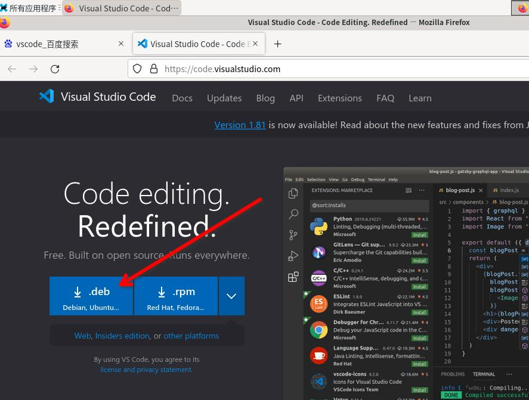

   选择deb包下载

等下载完事后，点一下“打开所在文件夹”按钮。

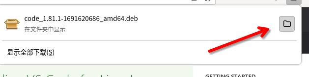

现在进入了文件管理器了——我们之前创建的1.lua和2.lua都在那呢。接下来就是把刚刚下载的安装包安装了，
右键空白区域，点击“在此打开终端”以启动终端。

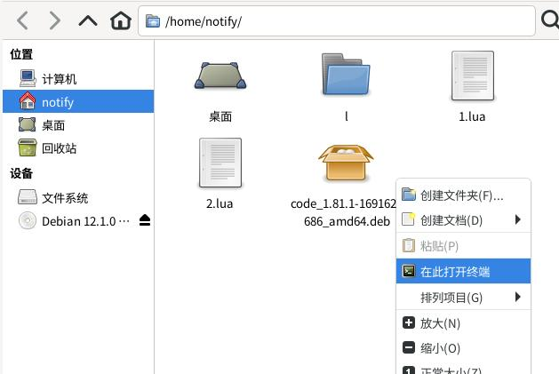

老规矩，安装东西要root权限，所以我们先用su切到root用户，然后用apt安装：

::

   $ apt install ./code_1.xx.xxxxxxxxx.deb (取决于你下载的文件名，建议用好复制和粘贴，以及注意文件名前面有点和斜杠）

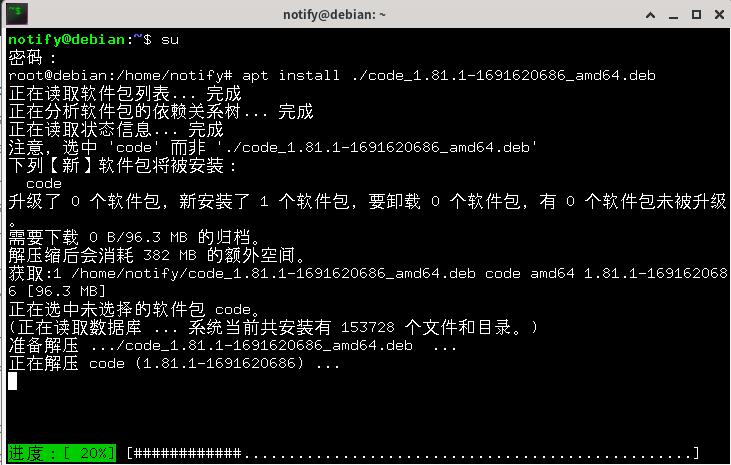

操练的话我们还需要Lua呢，以及后面还会聊到git，所以说安装上吧：（Lua一定要5.4版本的）

::

   $ apt install git lua5.4

至此vscode安装上了，在开始菜单的“开发”栏目下面理应能看到。

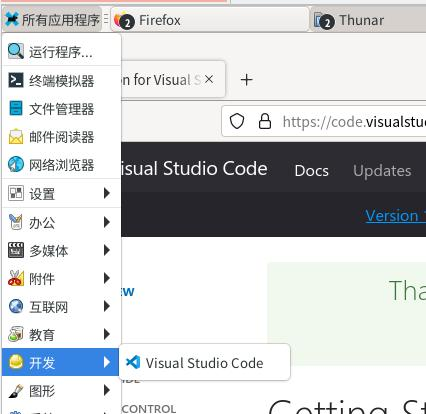

打开之后，因为我们系统语言是中文，所以他右下角会提示你安装中文语言包，点击安装就行；
还可能有外观配置的选项，因为做pdf嘛我就选了浅色的，各位根据喜好自己选择。

弄好了最初的配置之后，安装上Lua插件：点左侧栏拓展安装器，输入Lua，安装第一个。

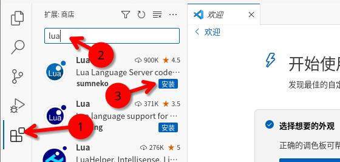

Windows环境
~~~~~~~~~~~~~

什么你直接跳过了开服那一章？失望

那么这里也说明一下如何在Windows下搭建Lua环境吧。首先安装好vscode。

开始Hello world
-----------------

至此，Lua也都弄好了，我们要正式开始了。似乎由于某个传统，新人的第一个程序都应该是向终端中显示
``Hello, world!`` ，那我们也来弄个这个吧。

.. hint::

   我们现在学习的是Lua语言的基本功能，因此编写的程序都是和命令行打交道的，
   多多回忆一下之前对于命令行的讲解吧。后面等差不多了之后我们就可以为新月杀编写Lua了。

首先，既然是学习，那就要有个崭新的开端了，新建个文件夹吧。点vscode左侧栏第一个，然后点打开文件夹：

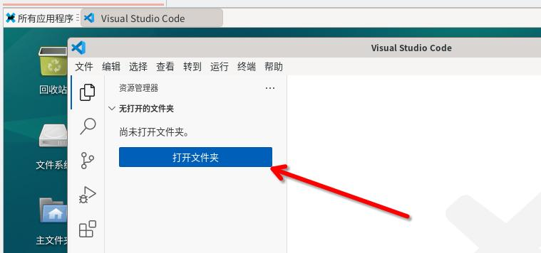

在弹出的文件夹选择界面，点一下新建文件夹按钮，然后创建名为studylua的文件夹。

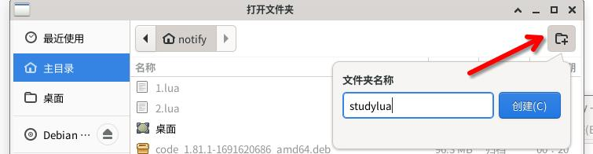

文件夹创建完成，此时应该会自动打开，我们再点右下角的“打开”。

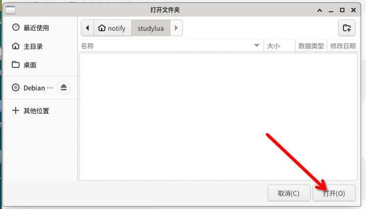

这样一来，就打开文件夹了，此时vscode会询问我们是否信任，那当然信任了，这不是我们自己创建的文件夹吗？（其实选不信任的话会没法使用Lua插件的功能）

这样vscode就打开了刚刚新建的文件夹，然后再新建一个hello.lua：

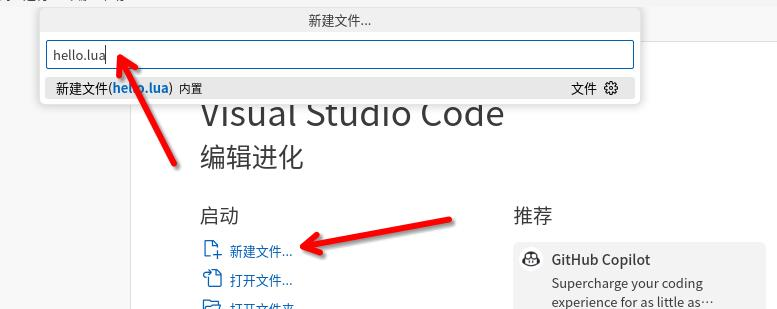

好了，敲下我们的第一行代码吧：

.. code:: lua

   print("Hello, world!")

注意到了没，现在文件栏那里hello.lua右侧有个黑色小圆点，这表示文件没有保存，我们需要按下Ctrl+S快捷键保存文件，或者菜单栏 -> 文件 -> 保存。

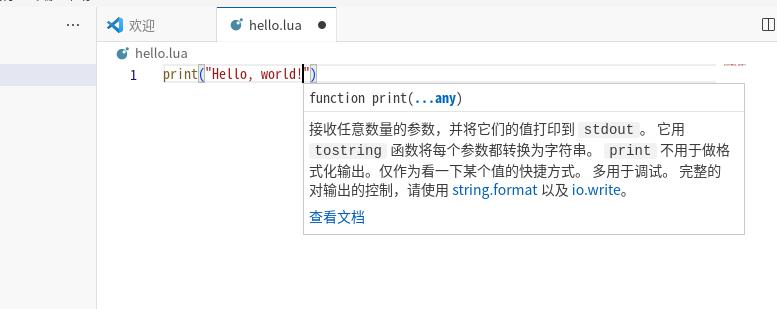

最后，我们运行一下。首先运行程序需要有一个终端，菜单栏 -> 终端 -> 新建终端：

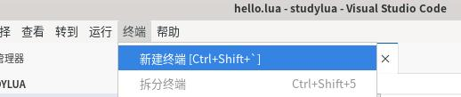

这样vscode的窗口底部应该会出现一个终端。注意到终端的提示符是~/studylua，这正是我们之前创建的文件夹；你可以在里面操练一下ls之类的命令，不过我们现在还是先运行起来为好：

::

   $ lua hello.lua
   >>> Hello, world!

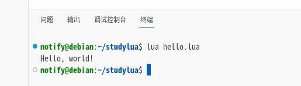

.. hint::

   执行一个lua文件使用的命令很自然的就是 ``lua`` 命令，跟随文件名作为参数1，表示要执行哪个文件。

至此，我们的Hello world程序就完成了！恭喜你完成了第一步！
