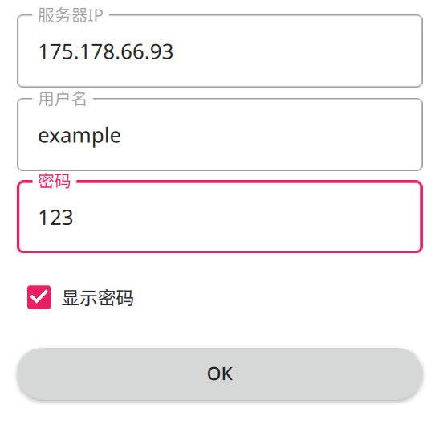

加入服务器游玩吧
==================

加入服务器
----------

启动新月杀后，界面中有四个按钮：单机启动、加入服务器、管理拓展包、退出。

因为新月杀是联机为主，单机根本没法玩，所以这里讲一下怎么进服务器。

首先点击“加入服务器”按钮，就会出现一个界面。界面底下又是一堆按钮。

- 加入服务器：先选中服务器列表中的一个服务器，再点此按钮加入该服务器。
- 添加服务器：向服务器列表中添加新的服务器。
- 编辑服务器：用来编辑自己在某个服务器中使用的用户名与密码。
  先选中一个服务器，再点此按钮进行编辑。
- 刷新列表：刷新服务器列表。此按钮基本上用不到，不用去点它。
- 探测局域网：后面讲局域网联机时候再说。
- 返回：关闭该界面。

此时界面还是空白的，点一下添加服务器，左边侧栏就会出现一个输入框。

我们需要在此填入服务器的IP地址、自己的用户名和密码。注意一定不要忘记自己的密码。

这里填了个目前常用的服务器地址。为了确保密码不输错，可以勾一下显示密码。

   添加服务器

写完后点一下OK按钮，然后服务器列表就会出现新的服务器。然后就加入吧。

   成功添加服务器

加入服务器时，会发生“同步拓展包”。游戏会自动下载服务器使用的拓展包，
此时切勿心情急躁，耐心等待吧。

关于加入失败
--------------

用户名密码错误
~~~~~~~~~~~~~~~

表现为屏幕底部提示用户名密码错误。可能是用户名被别人占用了，点击编辑服务器\
重新设定新用户名密码即可。

拓展包安装失败相关
~~~~~~~~~~~~~~~~~~~

表现为拓展包更新完成，但是弹了个很明显的报错窗。

这个问题也算是比较常见了，他会导致循环往复的无法进服，导致玩家变得不耐烦。\
遇到这种问题先保持冷静，注意看英文的报错。常见解法如下：

- 看到connection, SSL之类的词语：网络不通畅，检查浏览器能不能上gitee.com
- 看到“package/xxx: no such file or directory”或者“package/xxx:
  没有那个文件或目录”：这种是因为网络原因导致下载失败的。一般来说弹出这种\
  框的同时，屏幕下方还会提醒你“拓展包 xxx 出了问题，尝试在管理拓展包中\
  删除之然后再试”。这种情况的解决方法就是先重新启动程序，然后在四个按钮的\
  主界面点击“管理拓展包”，找到和报错信息一致的拓展包名字，点击删除将其删掉，\
  然后再次尝试连接到服务器。

如若还不能解决，那就卸载游戏重新安装得了。但这样会把所有东西全部重新下载\
一次，浪费时间也浪费流量。

以上的报错我自己没遇到过，但是在玩家中却十分常见。这也许就是所谓的开发者效应\
吧，作者日常不清楚bug，为此将下载拓展包相关的注意事项提醒如下：

.. warning::

   下载拓展包时，不要切屏！不要挂后台！确保网络环境畅通！

推荐的服务器IP
----------------

::

  qsgs-fans.top - 新月杀主服
  qsgs-fans.top:9552 - 新月车万包联机服务器
  qsgs-fans.top:9553 - 新月东方包联机服务器
  qsgs-fans.top:9555 - 氯师杀服务器
  huosan.top - 拓展大杂烩的PVE特化私服
..   huosan.top - 拓展大杂烩的PVP私服
