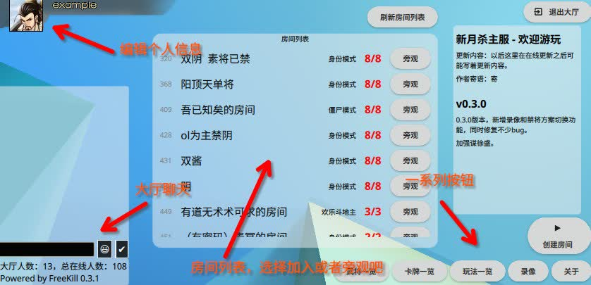

新月杀大厅说明
===============

现在你总算加入服务器了，可喜可贺。

   大厅界面

加入服务器后，你首先会进入服务器大厅。下面粗略介绍一下大厅的玩法。

左上角是你的头像，点击即可进行一些简单的设置，比如修改头像、更改游戏背景。

左下角是大厅聊天界面，可以在此打字聊天。

中间一块区域是房间列表，可以在此加入房间或者旁观房间。

右下角是一系列可以操作的区域，把每个按钮都按一下试试看吧。

点右上角离开大厅，此时你就退出服务器了。

有些东西需要用单开文章详细介绍，这里就提一下简单点的。

自己的头像
----------

点击后弹出一个简单的设置界面，可以修改自己的头像、密码。

注意屏幕最左侧可以切换设置页面。如果你注意到了的话，那么你就可以修改游戏背景、调节BGM音量了。

关于如何修改头像，后面会单独开文章介绍。不过有一点总没错：输入武将的拼音就可以把头像换成他了。

聊天
-----

下面那个黑色条就是输入的地方，点一下就能打字。

旁边的两个按钮分别是输入表情、发送消息。

房间列表
---------

此列表显示着服务器所有的房间。对于人数有空余的房间可以坐下参与对战，
人已经满了的房间就只能观战咯。

房间列表不会自动刷新，不过顶部提供了一个刷新房间列表的按钮。

服务器信息
-----------

屏幕右侧显示着服务器的自我介绍，以及新月杀本体的版本更新说明。

右下角的那些按钮
-----------------

- 武将一览、卡牌一览、玩法一览：查看服务器提供的武将、卡牌、游戏模式玩法。我当然都建议点开看看。
- 录像：回放保存的录像。
- 关于：查看新月杀主程序的自我介绍吧。看看是谁制作了这款游戏。
- 创建房间：创建自己的房间吧。
