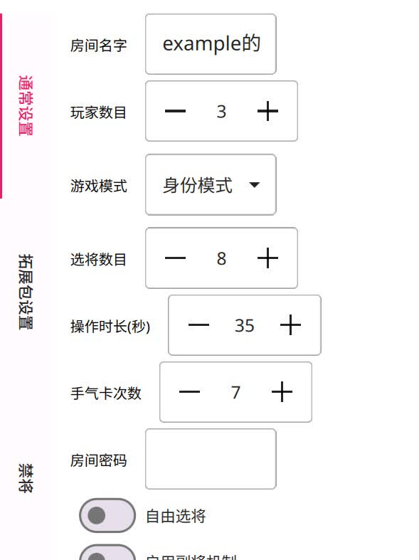

创建房间
=========

没找到能参与对局的房间？这再正常不过了，自己创建一个房间吧。

点击创建房间按钮，屏幕左侧就会弹出创房相关设置。有可能弹出的比较慢，请保持耐心。

不要怠慢了！此时你即将成为一名房主，你在创建房间时候做的设置与这一桌人的游戏体验息息相关。
这也是把创房单独拎出来讨论的原因所在。

房间的基础设置
-----------------

   基础设置

一定要注意到最左侧有分页标签！

在基础设置里面，你可以修改房间名字、指定游戏模式和玩家人数等等。这些设置应该是很好懂。

如果你只想和熟人对局，那么可以给房间设置密码。

最下面有两个开关，分别是是否自选武将、是否开启双将。

.. hint::

   开启了自选武将的战局将不会计入胜负统计。如果房间开启了自由选将，
   那么在选将的时候可以长按备选武将牌，将他变成任意一张武将牌。

房间的拓展包设置
-----------------

在这里设置自己想要开关哪些拓展包吧。不喜欢的拓展包通通关掉！

不过凡事都有个度，如果把将包全关完了或者把卡包都关了，那么进房间会因为将不够、牌堆不够而直接平局哦。

.. hint::

   卡牌扩展包在武将扩展包下面哦~

.. warning::

   如果不开启对应的卡牌扩展，那么如果有角色是需要从未开启的卡牌扩展中印卡，会无法获得此卡哦。
   不要关闭各种标记为衍生牌的拓展包，否则游戏将变得不正常（比如蒲元没法打造任何刀）。

禁将设置
--------

开房的时候还能设置禁将。你可以在禁将页面切换禁将方案，或者创建新方案。

禁用的武将将不会出现房间的选将框内。当然了，仅限于你创的房间。

点击禁将时可以禁止武将出现在你的武将选择框，或者是pve的技能池中。但是如果房间开启自由选将，则还是可以找到他们。
点击禁扩展包时，可以点击中间白色部分的小包，此时小包内的武将会被全部禁掉。
在点击禁将或禁扩展包时，右上角点击确定会取消禁将或禁扩展包，点退出会退出武将一览。

至于禁将方案的具体编辑，倒是不在这里，而是在武将一览页面。

先打开武将一览，再点击某张武将卡，此时屏幕的右上角就有个按钮能让你禁将或者解禁。

点击禁将时可以禁止武将出现在你的武将选择框，或者是pve的技能池中。但是如果房间开启自由选将，则还是可以找到他们。

点击禁扩展包时，可以点击中间白色部分的小包，此时小包内的武将会被全部禁掉。

在点击禁将或禁扩展包时，右上角点击确定会取消禁将或禁扩展包，点退出会退出武将一览。

至于方案的导入导出，游戏内应该已经说的很清楚了。还不快把你精心配置的禁将表分享出来？
