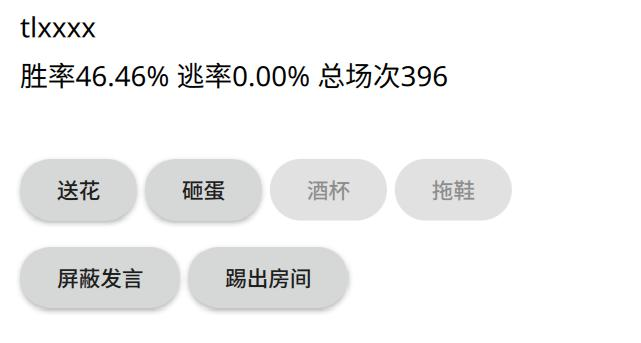

进房游玩
=========

总而言之，你刚好找到一个房间能玩，或者已经自己创了个房间了。

下面说说进房游玩的一些知识点。当然了，我是不会教你怎么打牌的。只是说一下和游戏无关的角度。

和他人交互
-----------

在房间中的时候，无论游戏开始与否，都可以和他人交互。甚至可以和自己交互。

操作方法就是长按那个人，或者鼠标右键点击，此时就会弹出这个：

   交互界面

如果游戏已经开始的话，这个界面会显示他拥有的武将技能。你可以在这里给他送花砸蛋啥的。
如果不想听他说话，可以屏蔽他发言。如果游戏没开始并且你是房主，你还可以把他踢了。

查看战报、聊天
---------------

左下角的聊天按钮能让你查看战报，或者参与聊天。

战报和聊天信息会不断自动向下滚动。如果你想固定某处细细观摩，可以在战报中间某处点击一下，
这时候战报就不会自动滚动了，同时顶部出现一个英文按钮。看够了之后，点一下顶部的按钮，
此时战报就又会回到自动滚动的状态了。

聊天倒是没啥特别需要说明的。

离开房间
---------

屏幕右上角有一个菜单按钮。点击之后，你可以选择投降或者逃跑。

投降需要满足一定条件才能投降，取决于游戏模式；逃跑的话想跑就可以跑。

点击之后都会弹出对话框供你确认，请三思后再做决定。

.. warning::

   逃跑的话会被服务器暂时封禁（一般是20分钟，取决于服主），同时增加你的逃率。
   当逃率过高的时候，只要进房游戏就会给房主弹出警告提示踢人，所以三思吧。

快捷键相关
------------

快捷键就是通过按下键盘上某个键触发的，因此只有PC可用，或者你一定要用安卓\
模拟器玩安卓版、给手机接个外接键盘啥的我也没意见。

以下所说的均是在牌局内才可触发

确定与取消
~~~~~~~~~~~~

Enter键即相当于按下确定按钮，空格键即相当于按下取消按钮。

全屏
~~~~~

F11。

查看距离
~~~~~~~~~

按下D键可以查看到别人距离，再按D键隐藏。

注意这个距离数字不会自动刷新，必须手动多按按D才行。

聊天
~~~~~

按下T键即相当于按下屏幕左下角的“聊天”按钮。视上次查看的内容会弹出战报或者\
聊天，对于喜欢打字的玩家十分利好。毕竟一局下来实际操作的次数也不多。

自动封禁相关
-------------

当初为了治理逃跑乱象而推出了逃跑禁赛机制（主服里面逃跑一次禁赛20分钟）。
不过这也带来一个问题，部分玩家因为不清楚机制导致稀里糊涂的被封了，特此说明。

.. note::

   禁赛是由程序自动进行封禁，即使是服主也无法解封。

从界面上看，左上角显示“托管中…”的就是逃跑，“已离开…”的就是掉线。

触发禁赛机制的时机：

1. 在对局未结束之前，通过菜单->退出直接离开房间的、且仍存活或者休整中的玩家；
2. 在对局结束时，离线的玩家。
3. 连续烧绳三次者自动踢出服务器，此时他变为离线状态。

因为主服装载有特效插件，这些特效非常具有迷惑性，因此特地说明如下：

- 在“一破 卧龙出山”时，被杀的其实处于濒死状态，他此时退出会视为逃跑。
- 在“傲视群雄”时，游戏其实没有结束，此时活着退出会视为逃跑。

一些人发现只封逃跑不封离线，那我直接把程序关了不就行了？据此推出结束时离线\
视为逃跑的规则。具体而言，注意事项如下：

- 离线时可立刻再次登入服务器，利用断线重连机制回到游戏中，避免惩罚。
- 阵亡后直接关掉程序会导致变成离线状态。阵亡后请先返回大厅再关闭游戏。
- 游戏结束时，离线玩家会被记录逃率并禁赛。

.. note::

   对于安卓而言，切换应用会导致进入离线状态。
