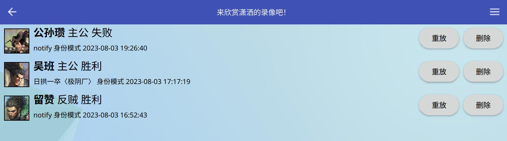

录像相关说明
=============

游戏结束后，弹出的对话框中会有一个“保存录像”的按钮。点击按钮即可保存。

重放录像
---------

在大厅界面（无论是在服务器还是单机都行）点击右下角的“录像”按钮，即可进入录像重放界面。

   录像重放界面

点击重放按钮后，即可重放对应的录像。

重放过程中可以减速、加速播放速度，也可以暂停播放。而匀速则是使烧条速度均匀化。

分享录像
---------

手机的话还是录屏发给他人吧！或者用MT管理器进入游戏目录，然后继续根据说明来。

.. hint::

   手机上的游戏目录即是 Android/data/org.notify.FreeKill/files 。

录像文件全部保存在游戏目录的 recording 文件夹下面。其命名规则稍微比较复杂，但只要看时间就知道对应谁了。

比如文件 ``20230803165243.notify.aaa_role_mode.ty__liuzan.rebel.rebel.fk.rep`` ，
前面的数字用年月日时分秒的格式表示录像的时间，而游戏内也写着录像的时间，这样就能很好对应了。

将这个文件通过某些手段分享给他人就行了。别人可以把录像文件放在自己的recording文件夹下，
这样他也就可以回看你的录像了。

播放任意录像
------------

除了界面列出的之外，你也可以从任何一个fk.rep结尾的文件播放录像。
点右上角菜单按钮，就会弹出选择文件的对话框了。
