操练：使用vmware安装Linux虚拟机
================================

直接花钱买Linux云服务器却不会操作的话，难免会令人感到不爽。

所以我们还是先在自己单机上操练操练吧。下面我们来安装一个搭载了Debian的虚拟机。

安装vmware
-----------

不赘述，百度即可。按理说随便搜搜vmware破解版就搜到了。

实在不懂就参考 https://zhuanlan.zhihu.com/p/616883406

（其实也没必要非要安装最新版，旧一点的版本一样没关系的）

获取和安装debian
-----------------

直接访问Debian官网： https://www.debian.org

进入官网稍微往下滑一下，就有个大大的“下载Debian”——点击即可。

点击进去之后再点击文件名下载：

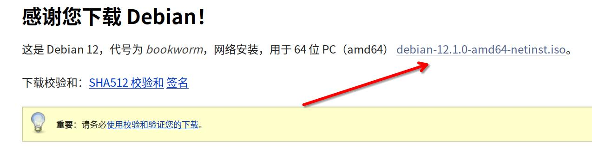

   下载debian安装镜像

.. hint::

   图里面这个镜像是联网安装，期间会连接外网下载资源。如若对网络不自信，请考虑离线版镜像
   https://cdimage.debian.org/debian-cd/current/amd64/iso-dvd/
   拖动到最下方点击下载ISO文件即可

等待下载完毕后，在vmware中新建虚拟机。
因为我没搞到中文版，所以新建虚拟机这块烦请参考 https://zhuanlan.zhihu.com/p/41940739。
照着这个网站新建虚拟机就行了，注意虚拟机名称以及发行版都应该选择Debian x64的。

创建完成后，在虚拟机页面先点击“编辑虚拟机设置…”，将ISO映像换成我们刚刚下载的那个。

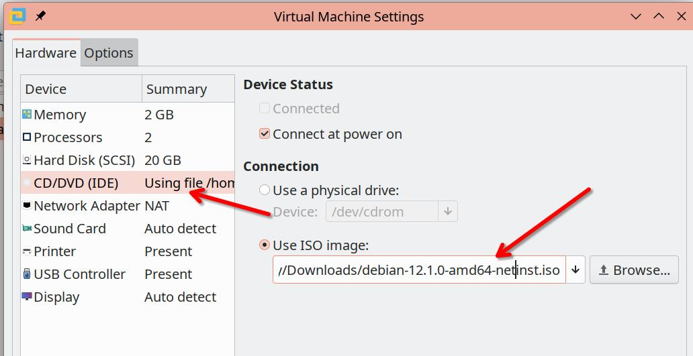

   选择刚刚下载的Debian ISO作为要使用的ISO映像

好，现在启动虚拟机。

先单击虚拟机，这样才能操控它。按下左Alt+左Ctrl可以随时返回自己的电脑。

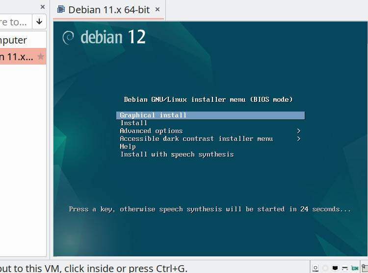

   选择Graphical Install，按回车

这样我们就进入安装界面了，先把语言选为“简体中文”，然后Continue.

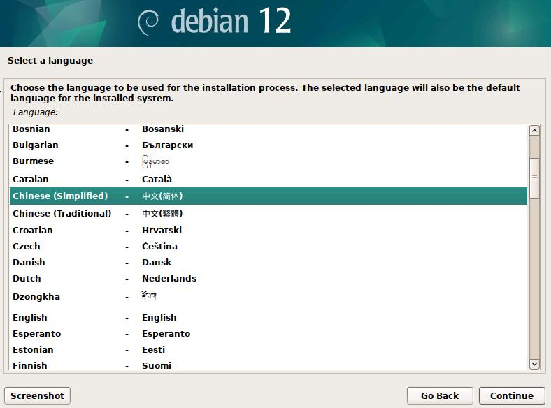

之后全都无脑点下一步，直到配置主机名界面，那里也不用管，点“继续”，直到配置root的密码。

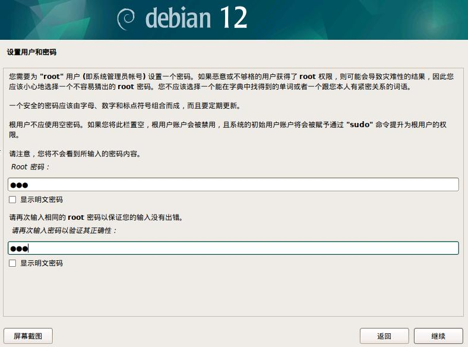

root密码随便填一个就行了，但是绝对别忘记了。因为是虚拟机所以怎么简单怎么来吧。

随后是配置自己的普通用户和密码，看着配置。

之后点击下一步之后到了配置磁盘，我们直接用默认的第一个，点击继续：

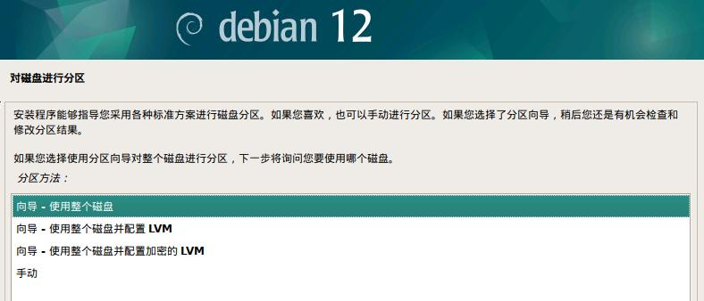

之后全部按默认推荐，无脑点击继续，直到这里：

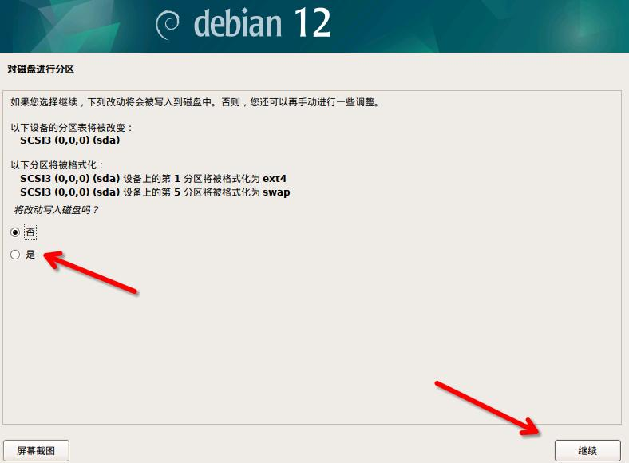

这里算是一个小小的坑点了，光标默认停在“否”那里，我们需要手动点击“是”才能继续安装。
这毕竟也是格式化磁盘的操作，肯定要用户手动确认的。不过不知道为什么就被口耳相传的变成了debian安装难点之一了。

总之点击“是”然后继续下一步就行了。

等待片刻后询问扫描额外安装介质……按默认的“否”就行，点继续。

重量级来了，现在需要选择包管理器的源。之前选完简体中文后大家应该选择了中国作为地区，所以这里仓库站点位于的国家，我们一样选择中国就行。

接下来是选择源镜像站了，虽然默认的deb.debian.org是个不错的推荐，但是我们还是选择清华源吧：

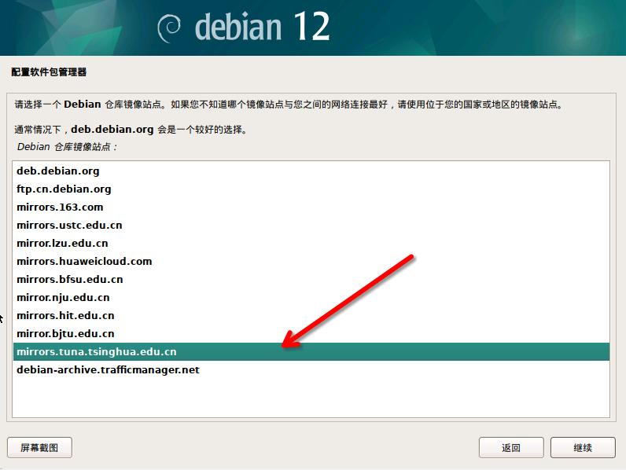

选择deb.debian.org也无伤大雅，毕竟他会自动给你选择合适的国内镜像站，但有时候难免出小问题，所以还是选清华源吧。

下一步填写http代理，直接无视掉，点下一步。

等待之后，流行度调查任选，之后就到了选择安装类型的时候了。

选择这几个：桌面环境和xfce，以及常用系统工具。

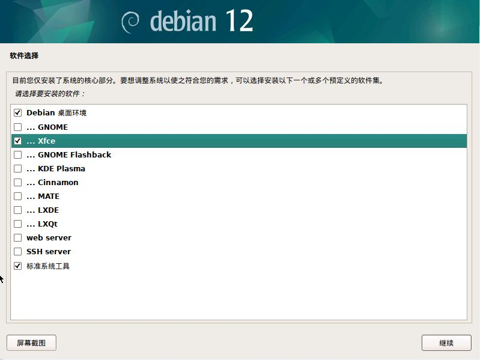

经过漫长的下载后，安装程序还提示我们安装grub（一个引导程序）。先选择“是”，然后下一步中选择自己的设备。

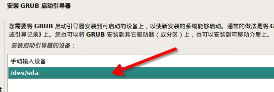

到这里，安装终于告一段落了。再点一下“继续”，虚拟机自动重启。

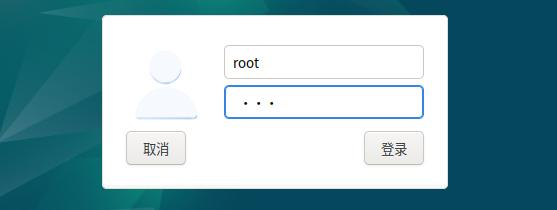

   用root账号登陆

因为是虚拟机所以我们用root账号登陆就好。

至此，我们进入了桌面！Linux虚拟机的安装流程也就此完结了。

使用快照功能
-------------

VMware的一个非常有用的功能之一就是快照。简而言之，快照相当于一个存档点，当我们搞砸了什么东西的时候，可以使用虚拟机快照立刻回到原先的状态。

菜单栏点击 虚拟机 -> 快照 -> 创建快照，新建一个快照。

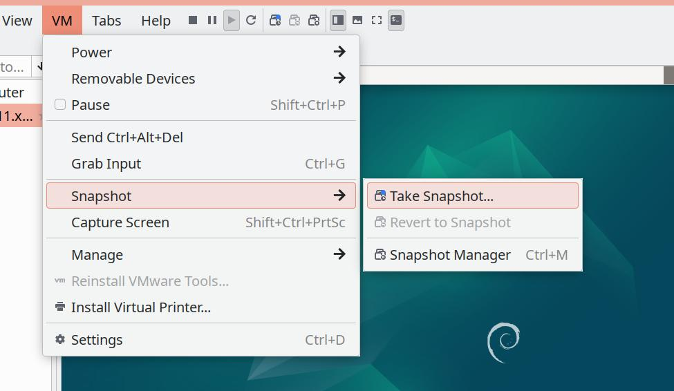

以后再次进入快照菜单的时候就有回档选项了。出了什么问题的话，还请善加利用。
