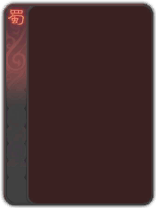

拓展规范文档
================

简介
-------

本文档仍处于草稿状态。
本文档针对未来的某个重构了拓展写法的新版本，目前（v0.5.3）应该是尚未实装，
仍在讨论可行性之中。

新月杀本身仅含有最基本的标准包，拓展是用以拓展游戏玩法的，其由一个或多个包
(package) 组成。为了使拓展的开发与维护更加便捷、统一，特制定此规范。

拓展与包的基本结构
--------------------

拓展存在于游戏目录的 ``packages/`` 目录之下，其本身是一个目录。文件结构如下：

::

    extension
    ├── init.lua
    ├── package1
    │   ├── init.lua
    │   └── skills
    │       ├── init.lua
    │       ├── jianxiong.lua
    │       └── ...
    ├── package2
    └── ...

拓展根目录中的 ``init.lua`` 需要加载其包含的所有包。

包可以用来拓展更多的技能、武将、卡牌、游戏模式。

每个包目录中的 ``init.lua`` 需要加载其包含的所有技能，然后其余部分定义该包含有的
武将、卡牌和游戏模式等。技能位于包的 ``skills/`` 目录下，每个技能置于单独的Lua
文件中， ``skills/init.lua`` 需要手动require目录中所有技能文件，并返回表。

定义武将
-----------

这里是一个完整扩展武将包的文件目录。

如果你看过新人入门教程，这里就是你的DIY武将在开发时，所需要了解的各种文件与代码的规范。

::

    package1
    ├── audio
    │   ├── death
    │   │   └── testGeneral.mp3
    │   └── skill
    │       ├── testGeneral_skill1.mp3
    │       └── testGeneral_skill2.mp3
    │   
    ├── image
    │   ├── generals  
    │   │   └── testGeneral.jpg
    │   └── kingdom 
    │       ├── testKingdom.png
    │       ├── testKingdom-back.png
    │       └── testKingdom-magatama.png
    │   
    ├── init.lua
    └── test.lua

首先，我们要明白一个概念，扩展包与武将包或者卡牌包。扩展包是你的个人扩展，在这个大分类中包含了你的武将扩展包与卡牌扩展包。

.. note::
  
  这里仅介绍武将扩展包。

package1是你的扩展包【英文代码】名称，请注意，**不要使用中文命名**

初次进入后，其内部应有如下几个文件或文件夹。（内部的文件夹划分拥有固定的名称，请不要随意更改）

1：audio
^^^^^^^^
audio是你的武将语音文件夹，其内部包括了death文件夹与skill文件夹。

.. warning::

    audio中的语音文件，应**全部是mp3格式。**

    如果单纯的从其他格式以重命名的方式修改为mp3，可能会导致无法播放，请注意使用转化软件或者在线网站。

    一个扩展包只能有一个audio文件夹与image文件夹，其内部可能存放多个其他文件夹。

death文件夹内部应放置武将的【阵亡语音】，**该语音的命名应与武将的代码名称相同。**

skill文件夹内部应放置武将的【技能语音】，**该语音的命名应与武将技能的代码名称相同。**

.. note::

    如果你的武将技能有多个语音，语音的命名格式应为武将技能的代码名称+语音编号。

    语音编号从1开始计算，例如testGeneral_skill1.mp3和testGeneral_skill2.mp3。

2：image
^^^^^^^^

image是你的武将立绘与势力图片的文件夹，其内部包括了generals文件夹和kingdom文件夹。

.. warning::

    image中的【武将立绘】文件，应**全部是jpg格式。**

    image中的【势力图片】文件，应**全部是png格式。**

generals文件夹内部应放置武将的【立绘】，**该立绘的命名应与武将的代码名称相同。**

对于武将的立绘同时拥有其文件大小的要求，请记住武将的立绘格式应为**250x292**大小。

kingdom文件夹内部应放置【DIY势力图片】，势力图片拥有三个部分，**均为png图片。**

.. note::

    如果你仅仅需要原版三国杀的势力，则不用创建本文件夹。

   势力的图标(格式最好在30x30-35x35之间)

   势力的阴阳玉(格式为10x12)

   势力的将框(格式为175x233)

势力图标的名称应为该势力的【英文代码名称】

势力阴阳玉的名称应为图标名称+(-magatama)。例如shu-magatama.png。

势力将框的名称应为图标名称+(-back)。例如shu-back.png。

3：init.lua
^^^^^^^^^^^

init文件是你扩展包的核心文件，**如果没有init.lua，新月杀就不会加载你的package1文件夹。**

在init文件中，应包含以下的函数或语句。

- 武将扩展文件引用语句
- 翻译函数
- return语句

完整的init.lua的内容如下

.. code-block:: lua
   :linenos:

   local test = require "packages/package1/test"
   -- 这一部分是武将扩展文件引用部分，
   -- packages不用改动，package1为你的扩展文件夹名称，test为你的武将扩展文件名称。

   Fk:loadTranslationTable {
    ["package1"] = "我的扩展包",
   }
   -- 这一部分是翻译函数，它会把扩展的英文代码在游戏里翻译为中文。
   -- 在init里的翻译函数，主要用来翻译扩展包的名称。

   return {
     test,
   }
   -- 这一部分是return 语句，其作用是返回你写的新月杀扩展文件。
   -- 写在return里的文件会被新月杀发现然后执行，没写的则不会执行。
   -- 如果你有多个扩展文件，请按照上述格式在return里进行编写。（test为之前引用的变量）

4：test.lua
^^^^^^^^^^^
test.lua是编写你的武将扩展的地方。其名称你可随意更改，但是请注意在init中的引用。

.. code-block:: lua
   :linenos:

   local extension = Package:new("package1")
   extension.extensionName = "test"
   -- 这一部分是武将扩展包的创建语句。
   -- 第一行为创建武将扩展包，其被分类在你的package1扩展中。这里需要填入你的扩展文本夹名称。
   -- 第二行为你的武将扩展包包名，test。请注意，包名应与你的武将扩展文件名一致。

   Fk:loadTranslationTable {
    ["test"] = "扩展武将包",
    ["testKingdom"] = "扩展武将势力",
   }

   local testGeneral = General:new(extension, "testGeneral", "testKingdom", 3, 4, General.Male)
   -- 这一部分是武将的创建函数。具体参数详情请查看General类。
   -- 我们创建了一个名为testGeneral的武将，他的势力是testKingdom，初始体力为3，体力上限为4，是一名男性。
   

   local testGeneral_skill1 = fk.CreateTriggerSkill{}
   local testGeneral_skill2 = fk.CreateTriggerSkill{}
   -- 这一部分是武将的技能创建，里面应有实际的技能效果。关于技能的详情请查看技能类，这里不再赘述
   
   testGeneral:addSkill(testGeneral_skill1)
   testGeneral:addSkill(testGeneral_skill2)
   -- 这一部分是武将的技能添加。如果不添加，则这个技能是无法在游戏里出现的。

    Fk:loadTranslationTable {
      ["testGeneral"] = "武将的名称",               
      ["#testGeneral"] = "武将的称号",               -- #+武将代码名称 (若不写此条目，默认为【官方】)
      ["~testGeneral"] = "武将阵亡语音台词",          -- ~+武将代码名称 (若不写此条目则无语音台词)
      ["designer:testGeneral"] = "武将的设计者",      -- designer:+武将代码名称 (若不写此条目，默认为【官方】)
      ["illustrator:testGeneral"] = "武将立绘的画师",  -- illustrator:+武将代码名称 (若不写此条目，默认为【官方】)
      ["cv:testGeneral"] = "武将语音的配音",          -- cv:+武将代码名称 (若不写此条目，默认为【官方】)

      ["testGeneral_skill1"] = "武将技能的名称",  
      ["$testGeneral_skill1"] = "武将技能的语音台词",  -- $+武将代码名称 (若不写此条目则无语音台词)
      [":testGeneral_skill1"] = "武将技能的描述",  -- :+武将代码名称 (若不写此条目则技能描述为武将技能英文代码名称)
    }

    return extension
    -- 千万不要忘记在文件的末尾加入返回语句
    -- 这里返回的是local extension = Package:new("package1") 之前创建武将扩展包时的对象。

到这里，对整个定义武将的流程就结束了，请各位按照规范编写代码哦~

定义卡牌
-----------

这里是一个完整扩展卡牌包的文件目录。你可以在这里了解制作卡牌扩展包所需要的各种文件与代码的规范。

::

    package1
    ├── audio
    │   ├── card
    │   │   ├── female
    │   │   │   └── card1.mp3
    │   │   └── male
    │   │       └── card1.mp3
    │   │
    ├── image
    │   ├── card  
    │   │   ├── delayedTrick
    │   │   │   └──card_delayedTrick.png
    │   │   ├── equipIcon
    │   │   │   └──card_equipIcon.png
    │   │   ├── card1.png
    │   │   └── card2.png
    │   │
    ├── init.lua
    └── testCard.lua

扩展包初次进入后，其内部应有如下几个文件或文件夹。（内部的文件夹划分拥有固定的名称，请不要随意更改）

1：audio
^^^^^^^^
audio是你的卡牌语音文件夹，其内部包括了card文件夹。而card内部又分为female与male文件夹。

female与male分别对应卡牌在使用时所播放的女性语音与男性语音。

**一张卡牌对应一个语音**，语音的命名与卡牌的代码名称相同。

.. warning::

    audio中的语音文件，应**全部是mp3格式。**

    如果单纯的从其他格式以重命名的方式修改为mp3，可能会导致无法播放，请注意使用转化软件或者在线网站。

2：image
^^^^^^^^

image是你的卡牌图片的文件夹，其内部包括了card文件夹。

.. warning::

    image中的card文件夹内部的图像文件，应**全部是png格式。**

card文件夹内部存放了三部分。

- delayedTrick文件夹
- equipIcon文件夹
- 卡牌立绘文件.png等

delayedTrick文件夹里面存放了DIY延时锦囊在使用后的图标。格式为**47x55**（若不需要则可以不用创建本文件夹）

equipIcon文件夹内部存放了DIY装备的小图标（即装备栏所见的小图标）。格式为**28x22**（若不需要则可以不用创建本文件夹）

.. warning::

    delayedTrick与equipIcon图标的命名格式需要与对应的延时锦囊牌或装备牌代码名称相同。

卡牌立绘则是主要的部分，在card文件夹中放置你的diy卡牌立绘。格式为**93x130 png**文件。

3：init.lua
^^^^^^^^^^^

init文件是扩展包的核心文件，引用时与武将扩展包方式一样，在【定义武将】板块讲解过的内容这里不再赘述。

4：testCard.lua
^^^^^^^^^^^
testCard.lua是编写你的卡牌扩展的地方。其名称你可随意更改，但是请注意在init中的引用。

.. code-block:: lua
   :linenos:

   local extension = Package:new("package1")
   extension.extensionName = "testCard"
   -- 这一部分是卡牌扩展包的创建语句。
   -- 第一行为创建卡牌扩展包，其被分类在你的package1扩展中。这里需要填入你的扩展文本夹名称。
   -- 第二行为你的卡牌扩展包包名，test。请注意，包名应与你的武将扩展文件名一致。

   Fk:loadTranslationTable {
    ["testCard"] = "扩展卡牌包",
   }

   local testCard1_skill = fk.CreateActiveSkill{}
   -- 这一部分是卡牌技能的创建函数。由于大多数卡牌都是主动使用才会触发，所以大部分卡牌都使用主动技。

   local testCard1 = fk.CreateBasicCard{}
   -- 这一部分是卡牌的创建函数。具体参数内容详情请查看CardSpec类。
   -- 卡牌分为基本牌，锦囊牌与装备牌。但是我们在创建卡牌的时候，需要注意卡牌的副类型。
   -- 例如，武器牌隶属于装备牌，但是我们在创建的时候需要使用以下函数来表示我们单独创建了一张武器牌。

   local testCard2 = fk.CreateWeapon{}
   -- Weapon是武器的意思，锦囊同理，也分为锦囊牌和延时锦囊。装备牌分为进攻马，防御马，防具，武器，宝物。
   
   Fk:addSkill(testCard1_skill)
   -- 请注意，卡牌的技能都是全局挂载，而不是绑定在某张卡上。

    Fk:loadTranslationTable {
      ["testCard1"] = "卡牌的名称",               
      [":testCard1"] = "卡牌效果的描述",  
      -- <b>牌名：</b>卡牌名称 <b>类型：</b>装备牌·武器（装备牌拥有副类时遵照此格式） <b>攻击范围</b>：1 <b>武器技能</b>：技能描述。
      -- <b>牌名：</b>卡牌名称 <b>类型：</b>基本牌 <b>时机</b>：出牌阶段 <b>目标</b>：一名其他角色 <b>效果</b>：对目标造成一点伤害
      -- 若类型为延时锦囊则直接写延时锦囊牌 即可。 
      -- 若某些卡牌拥有主动效果，例如丈八蛇矛，则需要对武器牌的skill进行翻译。翻译格式与武将技能格式一样。
    }

    extension:addCards({
      testCard1:clone(Card.Club,2),
      testCard1:clone(Card.Club,2),
    })
    -- 这里是往本卡牌扩展中添加卡牌，clone的数量代表了本卡包中有多少张这种牌。

    return extension
    -- 千万不要忘记在文件的末尾加入返回语句
    -- 这里返回的是local extension = Package:new("package1") 之前创建武将扩展包时的对象。

到这里，对整个定义卡牌的流程就结束了，请各位按照规范编写代码哦~

定义游戏模式
--------------

暂定

定义技能
-------------

暂定
